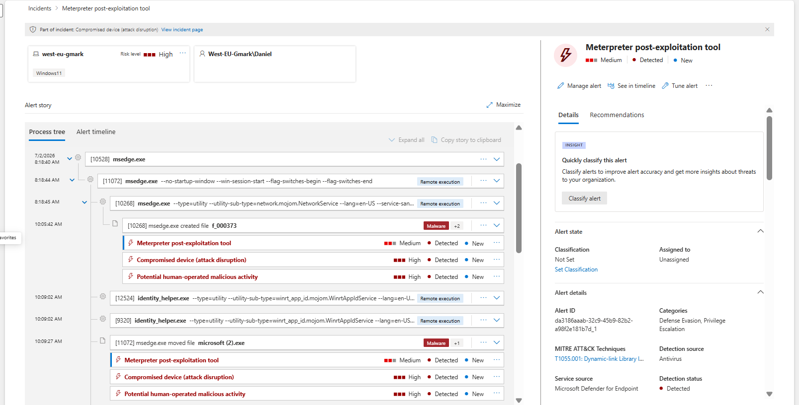

# 01 – Phishing Email Investigation

**Author:** Ovuowo Rukevwe  
**Role:** SOC Analyst (Security Home Lab)  
**Platform:** Microsoft Sentinel / Microsoft Defender XDR  
**Date of Investigation:** 2 July 2026  
**Incident Severity:** High  
**Incident Status:** Resolved – Malware Detected and Contained  

---

# Executive Summary

On **2 July 2026**, Microsoft Defender XDR generated an alert after an employee interacted with a suspicious phishing email containing a Google Drive link.

The investigation determined that the email was used as an initial access vector to deliver a malicious payload hosted through Google's legitimate file-sharing infrastructure. Although the email passed SPF, DKIM, and DMARC validation, the content was identified as malicious, demonstrating the abuse of trusted cloud services for malware distribution.

Analysis of Microsoft Defender XDR, Defender for Endpoint telemetry, email headers, process activity, and network events confirmed the following attack chain:

```
Phishing Email
      ↓
Google Drive Link
      ↓
Malicious File Download
      ↓
Payload Execution
      ↓
Meterpreter Activity Detection
      ↓
C2 Communication Attempt
```

The downloaded payload was identified as:

```
Trojan:Win32/Meterpreter.
```

Microsoft Defender successfully detected the malicious activity and isolated the endpoint. 

**Final Classification:**

> True Positive – Phishing-Based Malware Delivery Attempt Successfully Detected and Contained

---


# Detection Logic

Microsoft Defender XDR detected the phishing attack by correlating multiple security signals:

- Suspicious email content
- User interaction with embedded links
- Browser download activity
- Malicious file creation
- Malware execution behavior
- Network communication attempts

Detection confidence was increased through correlation of:

- Email telemetry
- Defender for Endpoint events
- Process activity
- Threat intelligence enrichment

The detection identified a phishing-based malware delivery chain rather than an isolated malicious file event.

---

# Incident Overview

| Field | Value |
|---|---|
| Incident Name | Phishing Email Malware Investigation |
| Severity | High |
| Category | Phishing / Malware Delivery |
| Detection Platform | Microsoft Defender XDR |
| SIEM Platform | Microsoft Sentinel |
| Initial Access Vector | Phishing Email |
| Delivery Method | Google Drive Link |
| Malware Family | Meterpreter |
| Affected Endpoint | Employee Workstation |
| Status | Resolved |

---

# Scenario

An employee reported receiving a suspicious email containing a Google Drive link.

The investigation was performed to determine:

- Whether the email was malicious.
- Whether the link delivered a malicious payload.
- Whether the endpoint was compromised.
- Whether further attacker activity occurred after execution.

The phishing email was exported as an `.eml` file and analyzed in Visual Studio Code to review headers, sender information, and authentication results.

---

# Investigation Questions

The investigation focused on answering the following SOC questions:

### 1. Was the email malicious?

- Did the email contain suspicious links or attachments?
- Did authentication results indicate spoofing?

### 2. What was delivered?

- Was a malicious file downloaded?
- What malware family was identified?
- What indicators were generated?

### 3. Did execution occur?

- Was the payload executed?
- What processes were created?
- Was malicious behavior observed?

### 4. Was the attacker successful?

The investigation checked for:

- Credential theft
- Persistence
- Lateral movement
- Command-and-control activity
- Data exfiltration

---

# Email Header Analysis

## Authentication Results

| Security Control | Result |
|---|---|
| SPF | Pass |
| DKIM | Pass |
| DMARC | Pass |

Although SPF, DKIM, and DMARC validation succeeded, further investigation identified malicious content hosted through Google Drive.

This demonstrates that attackers can abuse legitimate cloud services to distribute malware while bypassing traditional email authentication protections.

---

# Initial Phishing Email

The email contained a Google Drive link:

```
https://drive.google.com/file/...
```


---

# URL Analysis

After the user interacted with the link, Microsoft Defender telemetry identified the payload download location:

```
https://drive.usercontent.google.com/download?id=...
```

The download originated from Google's legitimate infrastructure but delivered a malicious executable.


---

# Detection in Microsoft Defender

Microsoft Defender for Endpoint detected the downloaded payload and generated a security alert.

The alert correlated:

- User interaction
- Browser activity
- File creation
- Malware detection
- Process execution
- Network activity

---

# Attack Chain Reconstruction

The investigation reconstructed the following attack sequence:

```
User opens phishing email
          ↓
User clicks Google Drive link
          ↓
Microsoft Edge downloads payload
          ↓
Payload stored in browser cache
          ↓
File staged locally
          ↓
Malware execution attempted
          ↓
Meterpreter behavior detected
          ↓
Endpoint isolated
```

---

# File and Malware Analysis

## Downloaded Artifact

Initial downloaded file:

```
f_000373
```

Location:

```
C:\Users\Daniel\AppData\Local\Microsoft\Edge\User Data\Default\Cache\Cache_Data\f_000373
```

Detected Malware:

```
Trojan:Win32/Meterpreter.A
```

SHA1:

```
8d8c4b86bb18481430949bf9cd58a6d5929d02aa
```

The payload was later staged as:

```
microsoft.exe
microsoft (2).exe
```

The naming convention indicates possible masquerading behavior.


---

# Process Analysis

The process tree confirmed the following execution chain:

```
msedge.exe
      |
      |
      v
Downloaded payload
      |
      |
      v
microsoft.exe
      |
      |
      v
Meterpreter Detection
```



---

# Network Activity Analysis

Following execution, Defender telemetry identified suspicious outbound communication.

Observed:

```
External IP:
45.142.193.145
```

Threat intelligence enrichment indicated previous malicious activity associated with this address.

Observed behavior:

- Possible command-and-control communication
- Non-standard outbound traffic
- Meterpreter-related activity


---

# Incident Correlation

Microsoft Defender incident graph correlated:

- Phishing email
- User interaction
- Downloaded file
- Malicious executable
- Process execution
- Network communication

This provided a complete attack lifecycle view.


---

# Indicators and Attack Artifacts

| IOC Type | Indicator | Description |
|---|---|---|
| Malware | Trojan:Win32/Meterpreter.A | Detected malicious payload |
| SHA1 Hash | 8d8c4b86bb18481430949bf9cd58a6d5929d02aa | Malware file hash |
| Download Artifact | f_000373 | Browser cache payload artifact |
| Malicious File | microsoft.exe | Masqueraded executable |
| Malicious File | microsoft (2).exe | Additional staged payload |
| Delivery Platform | Google Drive | Malware hosting location |
| Download Domain | drive.usercontent.google.com | Payload delivery source |
| External IP | 45.142.193.145 | Suspected C2 infrastructure |

---

# Attack Timeline

| Time | Event |
|---|---|
| Initial | Phishing email delivered to employee |
| After interaction | Google Drive link accessed |
| Following download | Payload written to browser cache |
| Execution | Malware staged locally |
| Detection | Defender identified Meterpreter activity |
| Response | Endpoint contained |


---

# Impact Assessment

## Confirmed

- Malicious phishing email delivered  
- User interacted with malicious link  
- Malware payload downloaded  
- Malware execution attempted  
- Defender detected malicious behavior  
- Endpoint containment initiated 
- Lateral movement 

---

## Not Confirmed

- Credential theft  
- Persistence mechanisms  
- Additional compromised hosts  
- Data exfiltration  

---

# Findings

- The phishing email used Google Drive as a malware delivery mechanism.
- SPF, DKIM, and DMARC validation passed, showing attackers abused legitimate infrastructure.
- Microsoft Edge downloaded the malicious payload.
- The payload was identified as Trojan:Win32/Meterpreter.A.
- The malware was renamed using trusted-looking filenames.
- Meterpreter-related behavior and outbound communication attempts were detected.
- Microsoft Defender successfully contained the endpoint.
- No evidence of lateral movement or persistence was identified.

---

# Remediation Recommendations

1. Continue phishing awareness training for employees.
2. Restrict access to suspicious cloud file-sharing links.
3. Enable advanced email protection policies.
4. Monitor unusual browser downloads.
5. Maintain endpoint detection and response capabilities.
6. Block identified malicious indicators through security controls.
7. Continue monitoring for related attacker infrastructure.

---

# Lessons Learned

The investigation highlighted the following security improvements:

- Email authentication controls such as SPF, DKIM, and DMARC reduce spoofing risk but do not prevent abuse of legitimate services.

- Attackers increasingly use trusted platforms such as Google Drive to distribute malware.

- Endpoint telemetry is critical for identifying malicious activity after a user interacts with phishing content.

- User awareness training remains important because phishing attacks often rely on user interaction.

- Browser download monitoring and endpoint detection capabilities help reduce the impact of malware delivery attempts.

---

# Final Incident Classification

**Verdict:** True Positive  

**Attack Type:** Phishing-Based Malware Delivery  

**Severity:** High  

**Outcome:**

The investigation confirmed a phishing attack that delivered a Meterpreter-based malware payload through Google Drive. Microsoft Defender successfully detected the malicious activity and contained the affected endpoint.

No evidence of lateral movement, persistence, or additional compromise was identified.

**Final Status: Resolved – Malware Detected and Contained**

---

Next: [02 - Brute Force Attack Investigation](./02-Brute-Force-Attack-Investigation.md)