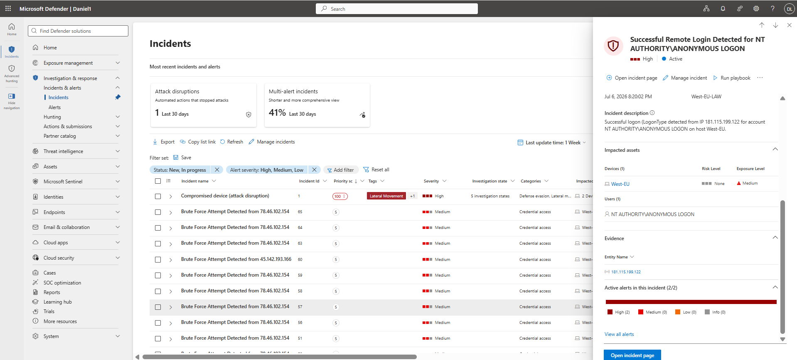
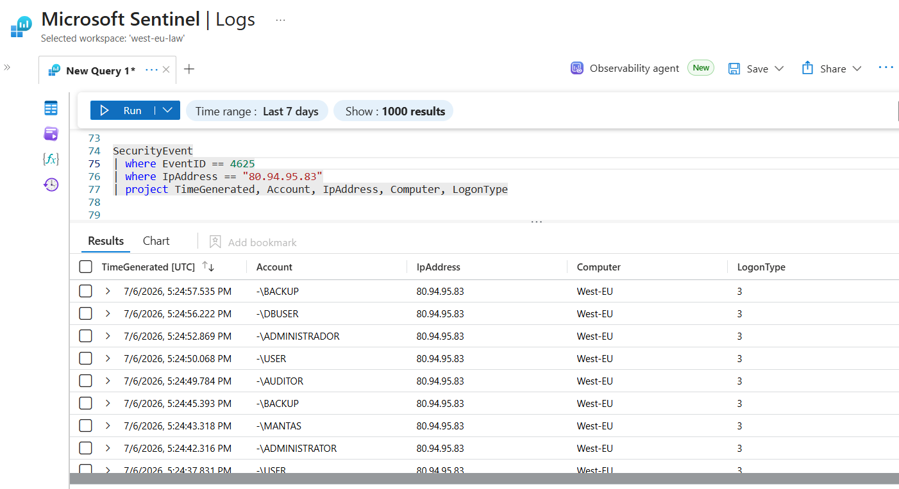
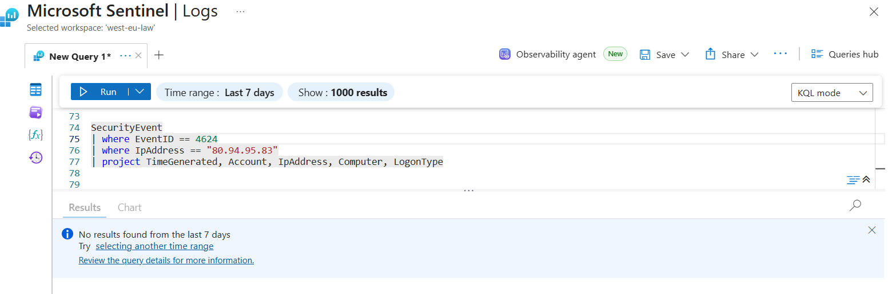
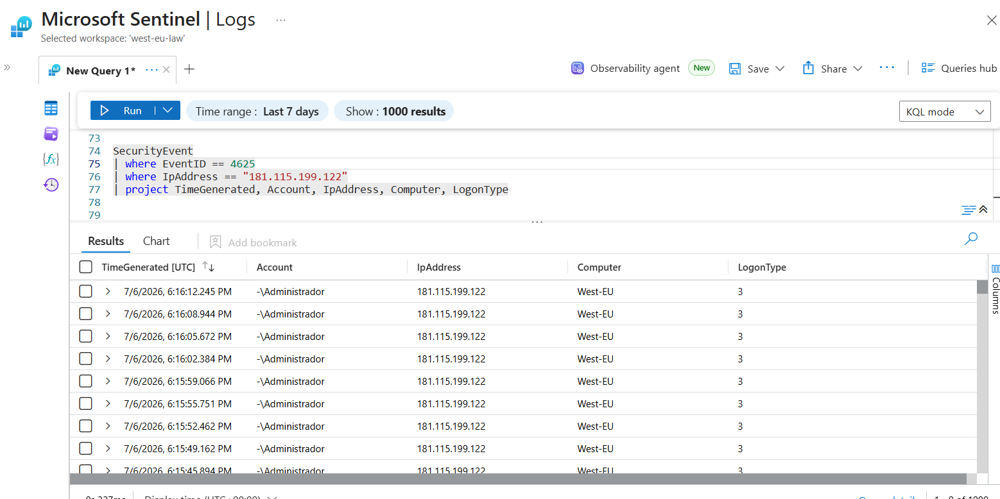
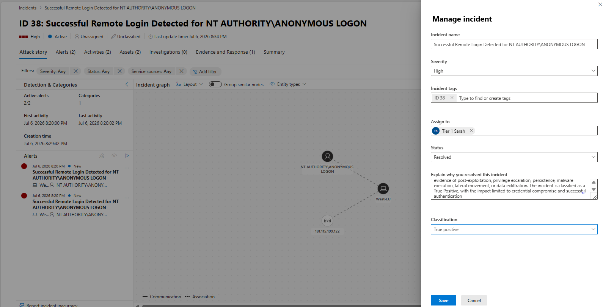
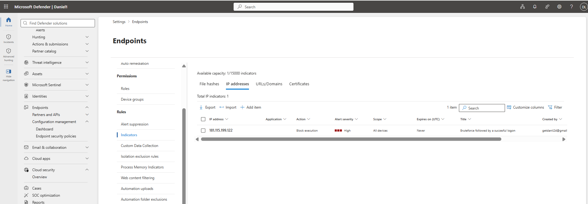

# 02 – Brute Force Attack Investigation

**Author:** Ovuowo Rukevwe  
**Role:** SOC Analyst (Security Home Lab Project)  
**Platform:** Microsoft Sentinel / Microsoft Defender XDR   
**Date of Investigation:** 6 July 2026  
**Incident Category:** Credential Access  
**Severity:** Medium  
**Status:** Closed – Investigated and Classified  

---

# Executive Summary

Microsoft Defender XDR and Microsoft Sentinel detected multiple authentication anomalies involving repeated failed login attempts against the **West-EU** server.

Two separate brute-force investigations were analyzed:

1. **Case 1 – Severity: Medium**  
   Failed Brute Force Attempt *(False Positive)*

2. **Case 2 – Severity: High**  
   Successful Authentication Following Brute Force Activity *(True Positive)*

The investigation involved reviewing:

- Windows Security Events
- Microsoft Defender XDR telemetry
- Microsoft Sentinel incidents
- Threat intelligence enrichment
- Authentication timelines

The first case involved repeated failed authentication attempts from a suspicious external IP address. No valid credentials were obtained and no compromise occurred.

The second case confirmed successful authentication after multiple failed login attempts from external IP addresses. The activity was classified as a **True Positive** because valid credentials were successfully used.

Further investigation found no evidence of:

- Malware execution
- Privilege escalation
- Persistence
- Lateral movement
- Data exfiltration

The confirmed impact was limited to unauthorized authentication.

---

# Detection Logic

Microsoft Sentinel and Microsoft Defender XDR detected brute-force activity by analyzing authentication telemetry.

The detection logic focused on:

- Multiple failed authentication attempts within a short period.
- Repeated authentication attempts from external IP addresses.
- Successful authentication following repeated failures.

Key telemetry sources:

- Windows Security Events (Event ID 4625)
- Successful logon events
- Defender XDR identity telemetry
- Threat intelligence enrichment

The confidence level increased when failed attempts were followed by successful authentication from suspicious external IP addresses.

---

# Incident Overview

| Field | Value |
|---|---|
| Incident Name | Brute Force Authentication Investigation |
| Category | Credential Access |
| Detection Platform | Microsoft Sentinel / Defender XDR |
| Target | West-EU Server |
| Attack Technique | Brute Force |
| MITRE ATT&CK | T1110 |
| Status | Closed |

---

# Investigation Methodology

The investigation followed the SOC workflow:

1. Review Microsoft Sentinel incident details.
2. Identify source IP addresses involved.
3. Analyze authentication events.
4. Validate successful or failed login attempts.
5. Enrich suspicious IP addresses with threat intelligence.
6. Review post-authentication activity.
7. Determine impact and classify the incident.

---

# Investigation Questions

The investigation focused on answering the following SOC questions:

### 1. Who initiated the attack?

- Which external IP addresses generated authentication attempts?
- Were the sources known malicious?

### 2. What happened?

- Were multiple failed authentication attempts observed?
- Were valid credentials successfully used?

### 3. Did compromise occur?

- Was unauthorized authentication successful?
- Which accounts were accessed?

### 4. What happened after access?

The investigation checked for:

- Malware execution
- Privilege escalation
- Persistence
- Lateral movement
- Data exfiltration

---

# Case 1 Severity:Medium – Failed Brute Force Attempt

## Incident Summary

Microsoft Defender XDR detected a repeated failed authentication attempts targeting the West-EU server.

| Attribute | Details |
|---|---|
| Incident ID | 30 |
| Source IP | 80.94.95.83 |
| Severity | Medium |
| Category | Credential Access |
| Technique | T1110 – Brute Force |

---

# Threat Intelligence Analysis

The source IP was investigated using threat intelligence.

Findings:

- Network: SS-Net
- ASN: 204428
- Location: United Kingdom
- Multiple security vendors flagged the IP as suspicious

---

# Authentication Log Analysis

Windows Security Events were reviewed.

Observed:

- Multiple failed authentication attempts.
- Windows Event ID:

4625 - Failed Logon Attempt

No successful authentication events were identified.

---

# Case 1 Impact Assessment

| Finding | Status |
|---|---|
| Brute-force activity | Confirmed |
| Failed authentication | Confirmed |
| Successful login | Not detected |
| Account compromise | Not identified |
| System impact | None observed |

---

# Case 1 Verdict

## Classification:

**False Positive – Failed Brute Force Attempt**

The activity was identified as malicious authentication behavior; however, the attacker failed to obtain valid credentials.

No unauthorized access occurred.

**Closure Status: Closed – False Positive**

# Case 2 Severity: High: Successful Authentication After Brute Force

---

# Incident Summary

Microsoft Defender XDR detected repeated authentication attempts followed by successful logins against the West-EU server.

| Attribute | Details |
|---|---|
| Incident ID | 37 |
| Severity | Medium |
| Category | Credential Access |
| Technique | T1110 – Brute Force |

---

# Source IP Investigation

Multiple external IP addresses were associated with brute-force activity.

| Source IP | Activity |
|---|---|
| 78.46.102.154 | Multiple failed authentication attempts |
| 80.94.95.83 | Multiple failed authentication attempts |
| 181.115.199.122 | Failed attempts followed by successful login |
| 84.192.175.75 | Failed attempts followed by successful login |
| 34.77.166.77 | Failed attempts followed by successful login |

---

# Successful Authentication Evidence

The investigation confirmed successful authentication events from:

181.115.199.122

84.192.175.75

34.77.166.77

---

# Threat Intelligence Findings

## 181.115.199.122

Findings:

- Registered to Empresa Nacional de Telecomunicaciones Sociedad Anonima (ENTEL), Located in Bolivia, Historical malicious activity observed.

- Multiple failed authentication attempts.

- Successful authentication detected

As seen on the incident portal

---

## 34.77.166.77

Findings:

- Associated with Google Cloud infrastructure
- Previous exposure of remote access services
- Services observed:

SSH
RDP
Web Services

---

## 84.192.175.75

Findings:

- Multiple failed authentication attempts.
- Followed by successful authentication.

---

# Post Authentication Investigation

After confirming successful authentication, additional telemetry was reviewed.

Reviewed:

- Defender Timeline
- Sentinel logs
- Windows Security Events

No evidence was identified for:

- Privilege escalation  
- Malware execution  
- PowerShell abuse  
- Credential dumping  
- Persistence creation  
- Lateral movement  
- Data exfiltration  

---

# Impact Assessment

| Finding | Status |
|---|---|
| Brute-force activity | Confirmed |
| Failed authentication attempts | Confirmed |
| Successful authentication | Confirmed |
| Credential compromise | Confirmed |
| Malware execution | Not observed |
| Persistence | Not observed |
| Lateral movement | Not observed |
| Data exfiltration | Not observed |

---

# Attack Timeline

| Event | Description |
|---|---|
| Initial activity | Multiple failed login attempts detected |
| Enumeration phase | Multiple authentication attempts against accounts |
| Compromise | Valid credentials accepted |
| Investigation | Endpoint and authentication telemetry reviewed |
| Response | Suspicious IP addresses blocked |

---

# Indicators and Attack Artifacts

| IOC Type | Indicator | Description |
|---|---|---|
| IP Address | 80.94.95.83 | Source of failed brute-force attempt |
| IP Address | 181.115.199.122 | Successful authentication source |
| IP Address | 84.192.175.75 | Successful authentication source |
| IP Address | 34.77.166.77 | Successful authentication source |
| Event ID | 4625 | Failed Windows authentication |
| Technique | T1110 | Brute Force |

---

# Response Actions

Actions performed:

- Investigated authentication activity.
- Reviewed successful login events.
- Performed threat intelligence enrichment.
- Blocked suspicious IP addresses.

---

# Lessons Learned

The investigation highlighted the following security improvements:

- Multi-factor authentication significantly reduces the risk of compromised credentials being abused.

- Authentication monitoring should detect abnormal login patterns such as repeated failures followed by successful access.

- Threat intelligence enrichment helps identify suspicious external sources and improve incident confidence.

- Successful authentication after brute-force activity should be treated as potential account compromise until validated.

- Remote access services should be regularly reviewed and restricted where unnecessary.

---

# Final Verdict

## Case 1

**Classification: False Positive – Failed Brute Force Attempt**

Repeated authentication attempts occurred, but no valid credentials were obtained.

---

## Case 2

**Classification: True Positive – Successful Unauthorized Authentication**

The investigation confirmed that brute-force activity resulted in successful authentication from multiple external IP addresses.

Although valid credentials were used, no additional malicious activity was identified after access was obtained.

**Confirmed Impact: Unauthorized Account Access Only**

---

# Closure Status

## Case 1

- Closed – False Positive

## Case 2

- Closed – True Positive

---

# Recommended Actions

1. Enable multi-factor authentication.
2. Review exposed remote access services.
3. Implement account lockout policies.
4. Monitor impossible travel authentication events.
5. Block confirmed malicious IP addresses.
6. Review privileged account exposure.

---

Previous:

[01 - Phishing Email Investigation](./01-Phishing-Email-Investigation.md)

Next:

[03 - Web Application Attack Investigation](./03-SQL-Injection-Investigation.md)