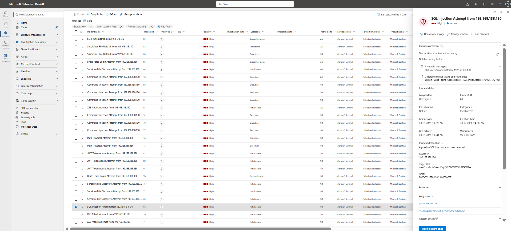
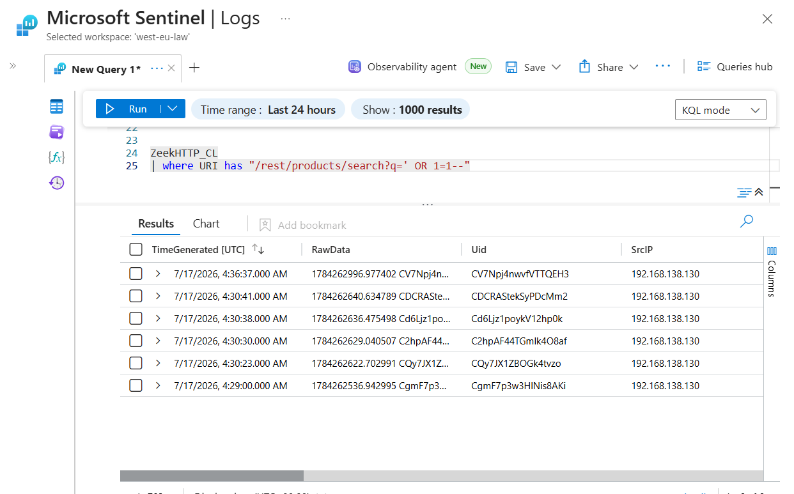
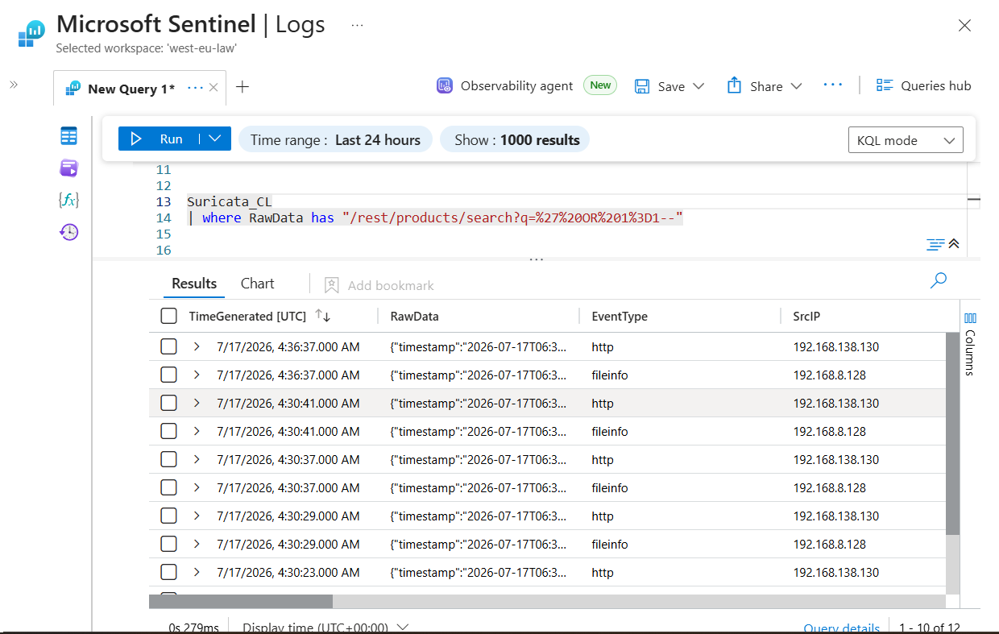
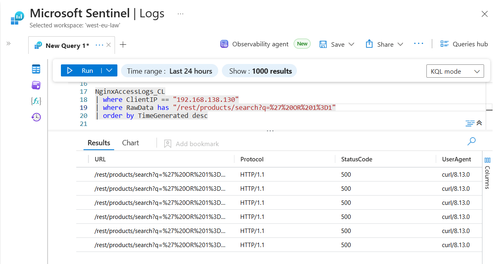
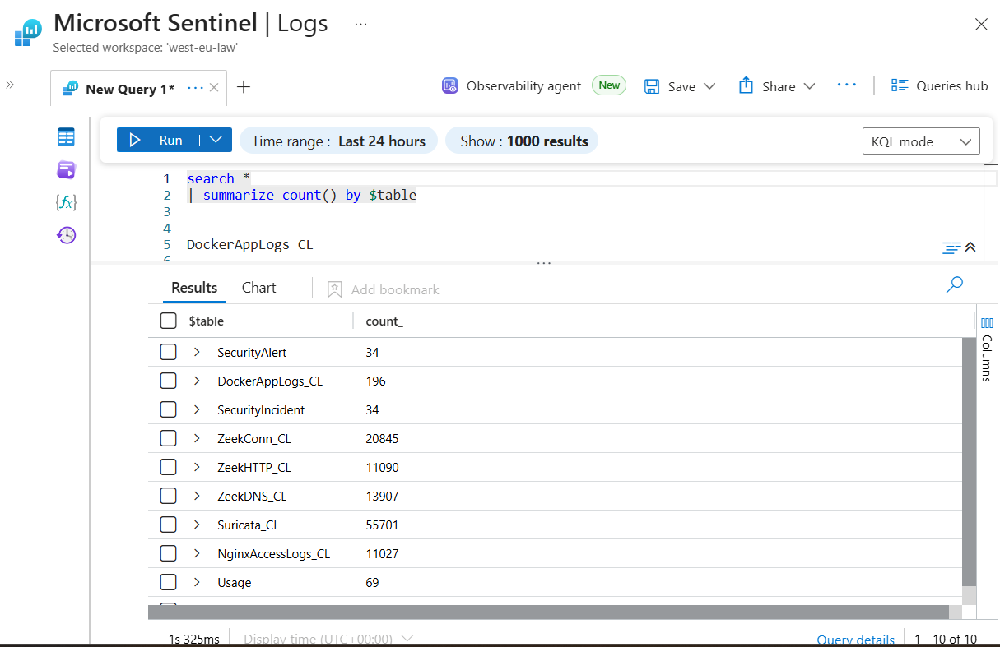
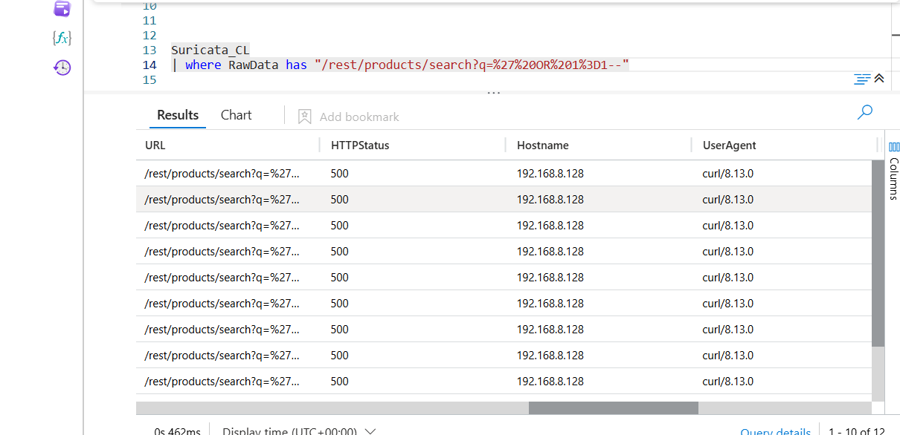

# 03 - SQL Injection Incident Investigation

**Author:** Ovuowo Rukevwe  
**Role:** SOC Analyst (Security Home Lab Project)  
**Platform:** Microsoft Sentinel / Microsoft Defender XDR  
**Date of Investigation:** 17 July 2026  
**Incident Severity:** Critical  
**Incident Status:** Closed – Attempt Detected, No Confirmed Command Execution

---


# Incident Overview

| Field | Value |
|------|-------|
| Incident ID | IR-2026-001 |
| Incident Type | Web Application Attack |
| Attack Category | SQL Injection |
| Severity | High |
| Detection Platform | Microsoft Sentinel |
| Investigation Platform | Microsoft Sentinel / Microsoft Defender XDR |
| Target Application | OWASP Juice Shop |
| Source IP | 192.168.138.130 |
| Destination IP | 192.168.8.128 |
| MITRE ATT&CK Technique | T1190 - Exploit Public-Facing Application |
| Detection Sources | Sentinel, Nginx, Zeek, Suricata |
| Investigation Date | 17 July 2026 |
| Analyst | Ovuowo Rukevwe |
| Final Classification | True Positive |
| Incident Status | Closed - No Evidence of Compromise |

---

# Executive Summary

On **17 July 2026**, Microsoft Sentinel generated a **High Severity** alert indicating a suspected **SQL Injection attempt** targeting the **OWASP Juice Shop** web application.

The malicious activity originated from source IP **192.168.138.130** and targeted the endpoint:

---




# Detection Logic

Microsoft Sentinel detected the SQL Injection attempt through correlation of web application telemetry from multiple sources:

- Nginx Access Logs
- Zeek HTTP Logs
- Suricata IDS Alerts

The detection logic identified suspicious SQL injection patterns within HTTP requests, including:

```
' OR 1=1--
```

The payload was URL encoded:

```
%27%20OR%201%3D1--
```

After decoding using CyberChef, the payload was confirmed as:

```
' OR 1=1--
```

The detection was based on:

- SQL logical operators
- SQL comment indicators
- Suspicious query manipulation patterns
- Abnormal HTTP request parameters

Detection confidence was increased through cross-validation across independent telemetry sources.


# Investigation Objective

The objective of this investigation was to determine whether the Microsoft Sentinel alert represented a genuine SQL Injection attack, identify the affected assets, determine the scope of the activity, evaluate the impact, and recommend appropriate containment and remediation actions.

---


### Alert Details

| Property | Value |
|----------|-------|
| Alert | Web SQL Injection Attempt |
| Severity | High |
| MITRE Technique | T1190 |
| Source IP | 192.168.138.130 |
| URL | /rest/products/search?q=%27%20OR%201%3D1-- |

The encode URL was decoded using cyberchef


---

# Investigation Questions

During the investigation, the following SOC investigation questions were addressed:

### 1. Who initiated the attack?

- What source IP generated the malicious request?
- Was the source internal or external?
- Was an authenticated user involved?

### 2. What was the attacker attempting?

- What payload was delivered?
- Which application endpoint was targeted?
- Was the payload consistent with SQL Injection techniques?

### 3. When did the activity occur?

- Was this a single request or repeated activity?
- Did additional attacks occur from the same source?

### 4. Did exploitation succeed?

- Was database access achieved?
- Were records retrieved?
- Was authentication bypass successful?
- Was sensitive information exposed?

### 5. Was additional malicious activity observed?

The source IP was investigated for related activity including:

- Cross-Site Scripting attempts
- Command Injection attempts
- Path Traversal attempts
- Brute Force activity
- Sensitive file discovery

---

# Initial Triage

The first objective during triage is to answer the fundamental SOC questions.


## WHO?

Questions:

- Who initiated the request?
- Which system was targeted?
- Which application was involved?
- Was any authenticated user involved?

### Query

```kusto
NginxAccessLogs_CL
| where ClientIP == "192.168.138.130"
| order by TimeGenerated desc
```

### Findings

| Item | Result |
|------|--------|
| Source IP | 192.168.138.130 |
| Target Host | 192.168.8.128 |
| Target Application | OWASP Juice Shop |
| User | None observed |


---

## WHAT?

The objective is to determine exactly what triggered the detection.

### Query (Zeek)

```kusto
ZeekHTTP_CL
| where URI has "/rest/products/search?q=' OR 1=1--"
```

Observed payload

```
' OR 1=1--
```



---

### Query (Suricata)

```kusto
Suricata_CL
| where RawData has "/rest/products/search?q=%27%20OR%201%3D1--"
```

Observed

```
/rest/products/search?q=%27%20OR%201%3D1--

```

---



### Query (Nginx)

```kusto
NginxAccessLogs_CL
| where ClientIP == "192.168.138.130"
| where RawData has "/rest/products/search?q=%27%20OR%201%3D1"
```

Observed

- HTTP GET request
- curl user agent
- SQL Injection payload

The payload was URL-decoded using CyberChef and confirmed to be:

```
' OR 1=1--
```



This is a well-known SQL Injection authentication bypass payload.


---

### Investigation Finding

The SQL Injection payload was independently observed in:

- Zeek HTTP logs
- Suricata IDS alerts
- Nginx Access Logs

Multiple telemetry sources confirmed the same malicious request.




---

## WHEN?

The next objective is determining whether this was an isolated event or part of a larger attack.

### Query

```kusto
NginxAccessLogs_CL
| where ClientIP == "192.168.138.130"
| order by TimeGenerated asc
```

Observed timestamps (UTC)

- 06:28:58
- 06:30:22
- 06:30:29
- 06:30:37
- 06:30:41
- 06:36:37

### Assessment

The requests occurred repeatedly within a short time window, indicating deliberate attack activity rather than accidental user input.


## HOW?

The attacker interacted directly with the application's search endpoint.

```
Attacker
192.168.138.130
        │
        ▼
Nginx Reverse Proxy
        │
        ▼
OWASP Juice Shop
        │
        ▼
/rest/products/search
```

The User-Agent identified during the requests was:

```
curl/8.13.0
```

This indicates the requests were manually generated or scripted rather than originating from a normal web browser.


# Timeline Analysis

The complete attack sequence was reconstructed from available telemetry.

| Time (UTC) | Activity |
|------------|----------|
| 06:28 | Initial web access |
| 06:30 | SQL Injection payload delivered |
| 06:31 | HTTP 500 response observed |
| Later | Additional reconnaissance and exploitation attempts |

---

# Cross-Source Correlation

The objective is validating the activity across independent telemetry sources.

| Data Source | Result |
|-------------|--------|
| Microsoft Sentinel | Alert generated |
| Nginx Access Logs | Request confirmed |
| Zeek HTTP Logs | Decoded payload confirmed |
| Suricata IDS | Signature matched |

Correlation across multiple log sources significantly increases confidence that the alert represents genuine malicious activity.

---


# Impact Assessment

The investigation assessed whether exploitation was successful.

Observed response codes

```
HTTP 500 Internal Server Error
```

No evidence was identified indicating:

- database extraction
- successful authentication bypass
- data exfiltration
- follow-on SQL queries

### Assessment

The payload successfully reached the application but there is no evidence that exploitation succeeded.

Current impact is assessed as:

**Attempted exploitation with no confirmed compromise.**

### Screenshot




---

# Indicators and Attack Artifacts

The following Indicators of Compromise (IOCs) were identified during the investigation and can be used for threat hunting, correlation, and future detections.

| IOC | Value |
|------|-------|
| Source IP | 192.168.138.130 |
| Destination IP | 192.168.8.128 |
| Target Endpoint | `/rest/products/search` |
| SQL Injection Payload | `' OR 1=1--` |
| User-Agent | `curl/8.13.0` |
| HTTP Response Status | `500 Internal Server Error` |
| MITRE ATT&CK Technique | T1190 – Exploit Public-Facing Application |

---

# Lessons Learned

The investigation highlighted several important security considerations:

- Web applications should implement strong input validation and parameterized queries to prevent SQL Injection attacks.

- Successful detection requires correlation between multiple telemetry sources rather than relying on a single log source.

- Encoded payloads should always be decoded during investigation because attackers frequently obfuscate malicious requests.

- HTTP error responses such as `500 Internal Server Error` should be investigated because they may indicate attempted exploitation.

- Detection rules should continuously be tuned to identify emerging attack patterns while reducing false positives.

- Web application logs provide valuable visibility into attacker behavior and should be integrated into SIEM platforms.

---

# Business Impact Assessment

The targeted application is an internet-facing web application. Based on the available evidence collected from Microsoft Sentinel, Nginx Access Logs, Zeek HTTP telemetry, and Suricata IDS alerts, there is **no evidence** that the SQL Injection attempt resulted in successful exploitation, unauthorized database access, data exfiltration, or application compromise.

The observed HTTP **500 Internal Server Error** responses indicate that the malicious payload reached the application; however, the available telemetry does not demonstrate successful execution of SQL commands.

**Business Impact Rating:** **Low**

**Technical Severity:** **High**

**Overall Risk Assessment:** **Attempted exploitation with no confirmed compromise.**

---

The next objective is determining whether additional malicious activity originated from the same source...

Previous:

[01 - Phishing Email Investigation](./02-Brute-Force-Attack-Investigation.md)

Next:

[03 - Web Application Attack Investigation](./04-XSS-Investigation.md)