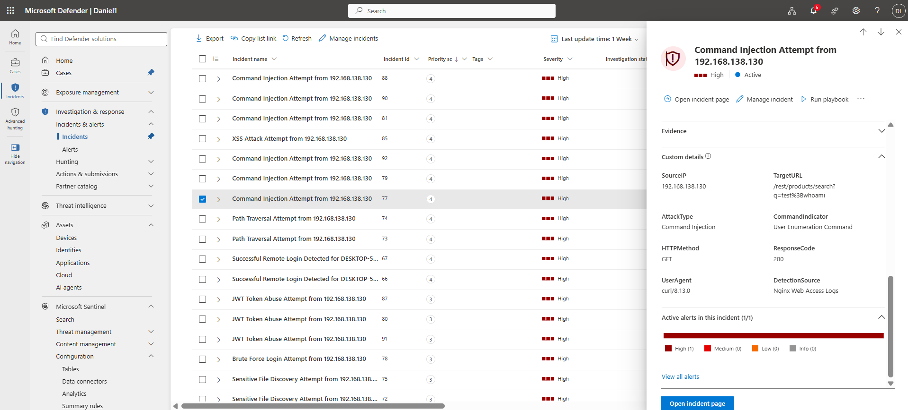
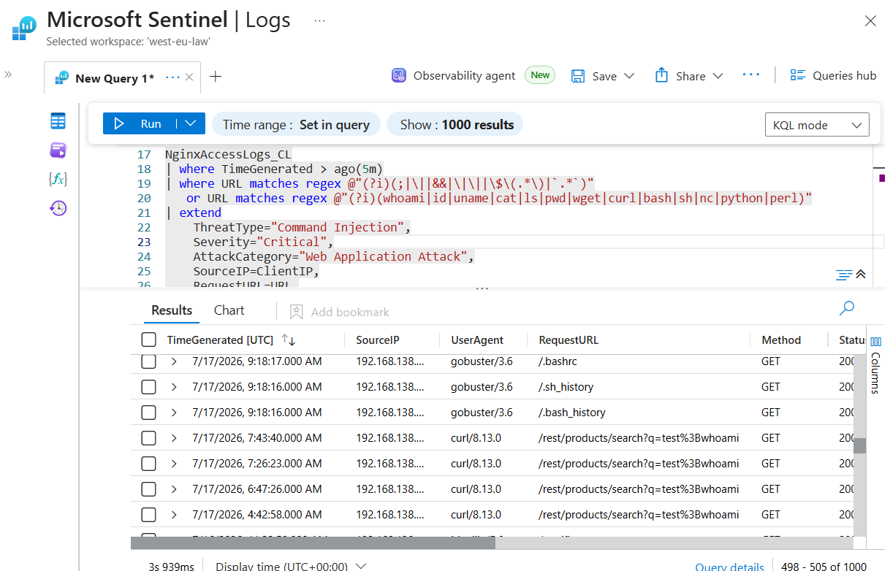
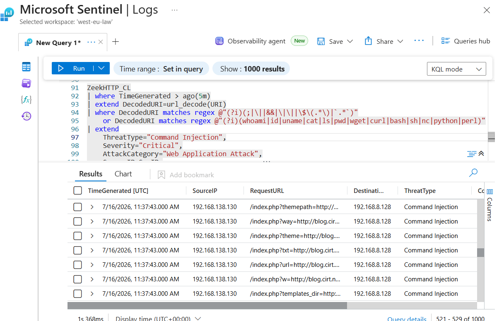
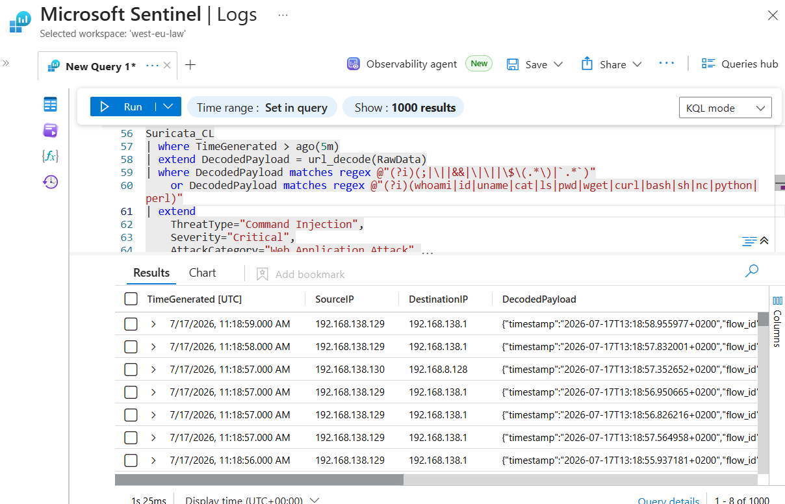

# 05 - Command Injection Investigation

**Author:** Ovuowo Rukevwe  
**Role:** SOC Analyst (Security Home Lab)  
**Platform:** Microsoft Sentinel / Microsoft Defender XDR  
**Date of Investigation:** 17 July 2026  
**Incident Severity:** Critical  
**Incident Status:** Closed – Attempt Detected, No Confirmed Command Execution

---

# Executive Summary

On **17 July 2026**, Microsoft Sentinel generated a **Critical Severity** alert indicating a suspected **Command Injection attack** targeting the OWASP Juice Shop web application.

The investigation identified suspicious HTTP requests originating from **192.168.138.130** containing command execution indicators commonly associated with operating system command injection attempts.

Analysis was performed using:

- Nginx Access Logs
- Zeek HTTP Logs
- Suricata IDS Events

The investigation identified command-related payload indicators including:

- `whoami`
- `id`
- `uname`
- Command separator characters such as `;`, `|`, and `&&`

The collected evidence confirmed that suspicious requests reached the web application. However, no evidence was identified showing successful operating system command execution, reverse shell activity, persistence, or data exfiltration.

The incident was classified as:

**Attempted Command Injection Attack – No Confirmed Command Execution**





---

# Detection Logic

Microsoft Sentinel detected the command injection attempt by analyzing web application traffic from:

- Nginx Access Logs
- Zeek HTTP Logs
- Suricata IDS

The detection logic searched for common command execution indicators including:


```
;
|
&&
||
$( )
`
```

and system commands such as:


```
whoami
id
uname
cat
curl
wget
bash

```

The alert confidence was increased by validating the activity across multiple independent security telemetry sources.

---

# Incident Overview

| Field | Value |
|---|---|
| Incident Name | Possible Command Injection Attack |
| Severity | Critical |
| Category | Web Application Attack |
| Detection Platform | Microsoft Sentinel |
| Target Application | OWASP Juice Shop |
| Source IP | 192.168.138.130 |
| Destination IP | 192.168.8.128 |
| Attack Type | Command Injection |
| Detection Sources | Nginx, Zeek, Suricata |
| Primary Detection Time | 17 July 2026 |
| Status | Closed |

---

# Attack Description

Command Injection is a web application vulnerability where an attacker attempts to execute operating system commands through vulnerable application inputs.

Successful exploitation may allow attackers to:

- Execute arbitrary commands
- Read sensitive files
- Enumerate system information
- Download malicious tools
- Establish persistence
- Obtain remote access

Common command injection indicators include:

```
;
|
&&
||
$(command)
`command`
```

and operating system commands such as:

```
whoami
id
uname
cat
wget
curl
bash
```

---

# Investigation Methodology

The investigation followed the following process:

1. Validate the Microsoft Sentinel detection.
2. Identify suspicious command indicators.
3. Correlate activity across multiple security telemetry sources.
4. Analyze HTTP requests and payload patterns.
5. Determine whether command execution occurred.
6. Assess impact and classify the incident.

---

# Investigation Questions

The investigation focused on answering the following SOC questions:

### 1. Who initiated the attack?

- What source IP generated the requests?
- Which application was targeted?

### 2. What was the attacker attempting?

- Were command execution patterns present?
- Which commands or payload indicators were observed?

### 3. Did exploitation succeed?

- Was an operating system command executed?
- Was a reverse shell established?
- Were files modified or accessed?

### 4. Was additional malicious activity observed?

The source IP was investigated for related activity including:

- SQL Injection
- XSS attempts
- File discovery
- Authentication attacks
- Malware activity


---

# Evidence Collection and Analysis

---

## 1. Nginx Access Log Analysis

### KQL Query

```kql
NginxAccessLogs_CL
| where TimeGenerated > ago(5m)
| where URL matches regex @"(?i)(;|\||&&|\|\||\$\(.*\)|`.*`)"
   or URL matches regex @"(?i)(whoami|id|uname|cat|ls|pwd|wget|curl|bash|sh|nc|python|perl)"
| extend
    ThreatType="Command Injection",
    Severity="Critical",
    AttackCategory="Web Application Attack",
    SourceIP=ClientIP,
    RequestURL=URL,
    DetectionSource="Nginx Web Access Logs"
| project
    TimeGenerated,
    SourceIP,
    RequestURL,
    Method,
    StatusCode,
    UserAgent,
    ThreatType,
    Severity
```




### Findings

Nginx logs identified multiple suspicious requests originating from:

```
Source IP:
192.168.138.130
```

Observed activity included requests containing command-related indicators.

Example indicators:

```
whoami
id
uname
```

The requests received HTTP responses indicating that the application processed the requests.

The web server received suspicious command injection attempts originating from the identified source host.

---

# 2. Zeek HTTP Analysis

### KQL Query

```kql
ZeekHTTP_CL
| where TimeGenerated > ago(7days)
| extend DecodedURI=url_decode(URI)
| where DecodedURI matches regex @"(?i)(;|\||&&|\|\||\$\(.*\)|`.*`)"
    or DecodedURI matches regex @"(?i)(whoami|id|uname|cat|ls|pwd|wget|curl|bash|sh|nc|python|perl)"
| extend
    ThreatType="Command Injection",
    Severity="Critical",
    AttackCategory="Web Application Attack",
    SourceIP=SrcIP,
    DestinationIP=DestIP,
    RequestURL=DecodedURI,
    DetectionSource="Zeek HTTP Logs"
| project
    TimeGenerated,
    SourceIP,
    DestinationIP,
    RequestURL,
    ThreatType,
    Severity,
    DetectionSource
| order by TimeGenerated desc
```



### Findings

Zeek identified suspicious HTTP requests from:

```
Source:
192.168.138.130

Destination:
192.168.8.128
```

Detected requests included suspicious endpoints:

```
/video
/Video
/videos
/utils
/validation
```

The activity pattern suggests automated testing or vulnerability discovery.

Zeek confirmed suspicious web activity consistent with command injection testing.

---

## 3. Suricata IDS Analysis

### KQL Query

```kql
Suricata_CL
| where TimeGenerated > ago(5m)
| extend DecodedPayload=url_decode(RawData)
| where DecodedPayload matches regex @"(?i)(;|\||&&|\|\||\$\(.*\)|`.*`)"
    or DecodedPayload matches regex @"(?i)(whoami|id|uname|cat|ls|pwd|wget|curl|bash|sh|nc|python|perl)"
| extend
    ThreatType="Command Injection",
    Severity="Critical",
    DetectionSource="Suricata IDS"
| project
    TimeGenerated,
    ThreatType,
    Severity,
    DetectionSource,
    DecodedPayload
| order by TimeGenerated desc
```



### Findings

Suricata detected HTTP traffic associated with command injection indicators.

Observed classification:

```
Threat:
Command Injection

Indicator:
System Identity Command
```

The source host was:

```
192.168.138.130
```

Suricata provided additional confirmation that suspicious command execution patterns were transmitted.

---

# Timeline

| Time UTC | Event |
|---|---|
| 17 July 2026 10:03 | Suspicious web requests detected by Nginx |
| 17 July 2026 10:05 | Zeek detected command injection indicators |
| 17 July 2026 11:18 | Suricata detected system identity command attempts |

---

# Impact Assessment

### Confirmed

- Suspicious command injection requests reached the web application.
- Multiple command execution indicators were observed.
- Multiple security tools detected the activity.

### Not Confirmed

- Successful OS command execution.
- Reverse shell connection.
- Malware execution.
- File modification.
- Data exfiltration.
- Persistence.

---

# Indicators and Attack Artifacts

| IOC Type | Indicator | Description |
|---|---|---|
| Source IP | 192.168.138.130 | Host generating command injection attempts |
| Destination IP | 192.168.8.128 | Target web application |
| Command Indicator | whoami | System identity discovery attempt |
| Command Indicator | id | User/group enumeration attempt |
| Command Indicator | uname | System information discovery attempt |
| Attack Pattern | ; \| && | Command separator injection attempts |

---

# Recommendations

- Implement strict input validation on user-controlled parameters.
- Avoid passing user input directly into operating system commands.
- Use secure APIs instead of shell execution.
- Apply least privilege permissions to web applications.
- Deploy Web Application Firewall rules for command injection patterns.
- Continue monitoring for repeated exploitation attempts.

---

# Lessons Learned

The investigation highlighted the following security considerations:

- User-controlled input should never be passed directly to operating system commands.

- Detection rules should monitor both command separators and common system command patterns.

- Multiple telemetry sources improve confidence when validating web application attacks.

- Command injection attempts should be investigated for possible follow-on activity such as reverse shells or malware execution.

- Web applications should follow secure coding practices and least privilege principles.

---

# Final Incident Classification

**Incident Type:** Web Application Attack  
**Attack:** Command Injection Attempt  
**Severity:** Critical  
**Verdict:** True Positive  

**Final Assessment:**

The investigation confirmed a command injection attempt targeting the web application. Multiple telemetry sources detected suspicious command execution indicators originating from 192.168.138.130. However, no evidence of successful command execution or system compromise was identified.

**Resolution: Attempt Detected – No Confirmed Command Execution**


Previous:

[04 - XSS Investigation](./04-XSS-Investigation.md)

Next:

[06-Suspicious-File-Upload-Investigation](./06-Suspicious-File-Upload-Investigation.md)