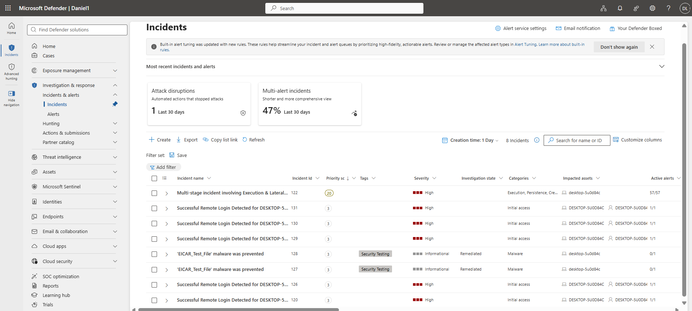
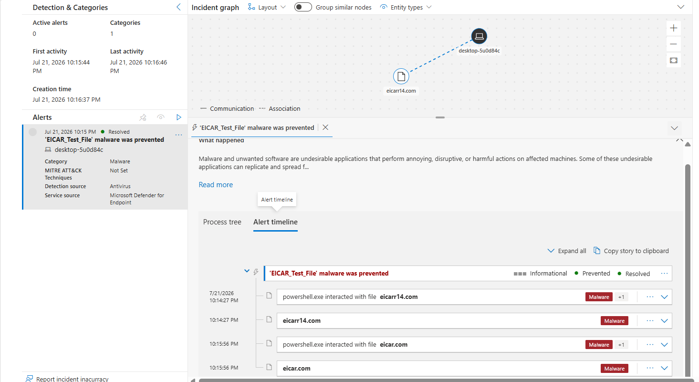
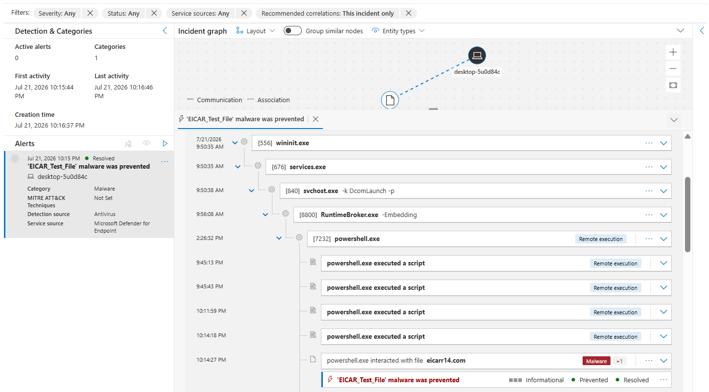
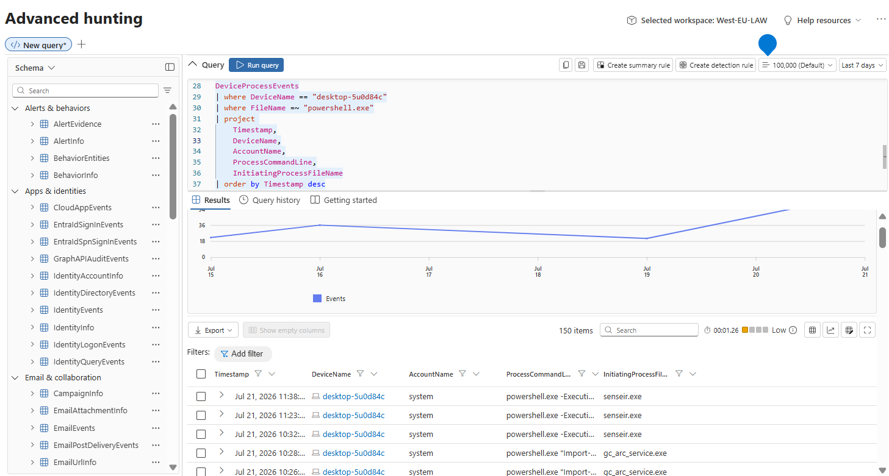
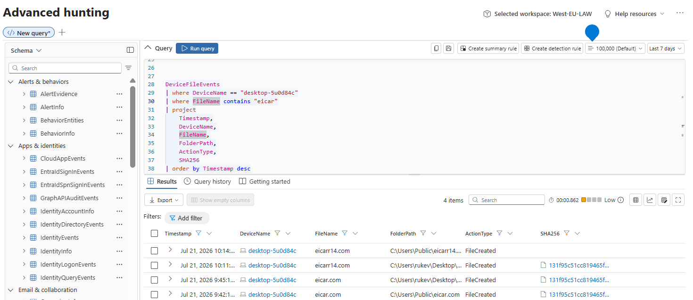
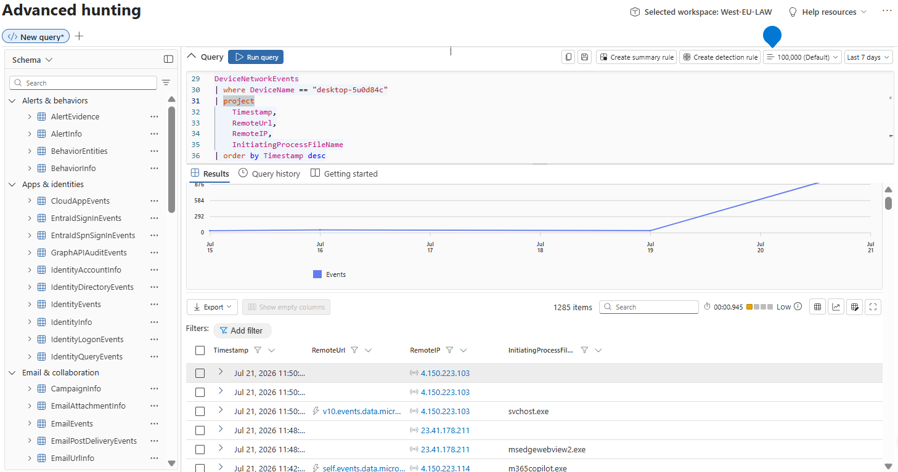

# 07 – Malware / Payload Execution Investigation

**Author:** Ovuowo Rukevwe  
**Role:** SOC Analyst (Security Home Lab)  
**Platform:** Microsoft Sentinel / Microsoft Defender XDR  
**Date of Investigation:** 21 July 2026  
**Incident Category:** Malware Prevention / Payload Delivery  
**Severity:** Informational  
**Status:** Resolved (Automated Remediation)

---

# Executive Summary

Microsoft Defender for Endpoint generated an alert after PowerShell interacted with the EICAR antivirus test files (`eicar.com` and `eicarr14.com`).

Microsoft Defender Antivirus successfully detected and prevented the payload before execution.

The investigation confirmed that the activity was part of an authorized security validation exercise. No evidence of successful malware execution, persistence, credential theft, privilege escalation, lateral movement, or command-and-control activity was identified.

---





# Incident Overview

| Field | Value |
|---|---|
| Incident ID | 128 |
| Alert Name | EICAR_Test_File malware was prevented |
| Detection Source | Microsoft Defender Antivirus |
| Security Product | Microsoft Defender for Endpoint |
| Affected Device | desktop-5u0d84c |
| Operating System | Windows 10 |
| Classification | Security Testing |
| First Activity | 21 Jul 2026 22:14:27 |
| Last Activity | 21 Jul 2026 22:16:46 |
| Resolution | Automatically Remediated |

---

# Investigation Objectives

The investigation aimed to:

- Validate the Defender alert.
- Identify the initiating process.
- Determine whether the payload executed.
- Identify potential attacker activity.
- Assess endpoint impact.
- Confirm whether additional compromise occurred.

---

# Alert Summary

Microsoft Defender detected two files matching the EICAR malware test signature.

Detected files:

```
eicar.com
eicarr14.com
```

Defender response:

```
Detection
|
Prevention
|
Remediation
|
Incident Auto Resolution
```


The alert was classified as **Informational** because the activity was associated with an authorized security test and no compromise occurred.

---

# Severity Explanation

Although the detection involved malware classification, the alert severity remained Informational because:

- The files were EICAR test payloads.
- Execution was prevented.
- No malicious activity continued after detection.
- The event was part of a controlled security validation exercise.

---

# Incident Timeline

| Time | Event |
|---|---|
|22:14:27|PowerShell interacted with `eicarr14.com`|
|22:14:27|Microsoft Defender detected EICAR test file|
|22:14:27|Payload prevented|
|22:15:56|PowerShell interacted with `eicar.com`|
|22:15:56|Payload prevented|
|22:16:37|Incident created|
|22:31|Incident automatically resolved|





---

# Attack Chain Analysis

Observed activity:

```
PowerShell
|
|
Accessed EICAR Test File
|
|
Microsoft Defender Detection
|
|
Payload Prevented
|
|
Automated Remediation
```

---


# Process Investigation

## Initial Process

Observed process:

```
powershell.exe
```

PowerShell was responsible for interacting with the detected files.

### Observed related processes:

```
powershell.exe

cmd.exe

whoami.exe

ipconfig.exe
```


These commands are commonly used for administrative activity and lab validation.

No malicious child processes were observed.

---

# Process Tree Analysis

Observed execution chain:

```
wininit.exe

↓

services.exe

↓

svchost.exe

↓

RuntimeBroker.exe

↓

powershell.exe
```




Additional activity:

```
powershell.exe
|
|
cmd.exe
|
|
whoami.exe
|
|
ipconfig.exe
```

The process tree does not show evidence of:

- Malware execution
- Persistence installation
- Credential dumping
- Lateral movement

---

# Malware / Payload Analysis

## Detected Files

| File | Classification | Defender Action |
|-|-|-|
|eicar.com|EICAR Test Malware|Prevented|
|eicarr14.com|EICAR Test Malware|Prevented|

---

# Execution Analysis

## Investigation Question

**Was the payload executed?**

## Answer

No evidence indicates successful execution.

Evidence reviewed:

- Defender alert timeline
- Process tree
- Evidence and Response
- Automated Investigation results

Finding:

The files were detected during file interaction and prevented before execution.

No malicious processes were spawned from the detected files.

---

# Device Risk Analysis

## Investigation Question

**Why does Defender show the device as High Risk?**

## Answer

The device risk score represents the overall Defender exposure assessment.

The available evidence does not indicate that this incident caused the device risk rating.

This incident alone does not demonstrate endpoint compromise.

---

# Network Analysis

## Investigation Question

**Did the malware communicate with a Command-and-Control server?**

## Answer

No evidence of C2 communication was identified.

The observed communication was related to retrieving the EICAR test files.

No suspicious external infrastructure or persistence traffic was identified.

---

# Persistence Analysis

Reviewed for:

- Registry Run Keys
- Startup folder modifications
- Scheduled Tasks
- Services
- WMI persistence

Finding:

No persistence mechanisms identified.


---

# Credential Access Analysis

Reviewed for:

- LSASS access
- Credential dumping tools
- Mimikatz activity
- Password extraction

Finding:


No credential theft indicators identified.


---

# Lateral Movement Analysis

Reviewed for:

- Remote execution tools
- SMB movement
- PsExec
- Remote service creation

Finding:


No lateral movement indicators identified.

# MITRE ATT&CK Mapping

| Technique | Name | Evidence |
|-|-|-|
|T1059.001|PowerShell|PowerShell script execution|
|T1105|Ingress Tool Transfer|Accessing EICAR test payload|

No additional ATT&CK techniques were mapped due to lack of supporting evidence.

---

# Indicators and Observed Artifacts (IOCs)

| Type | Indicator | Description |
|------|-----------|-------------|
| Host | `desktop-5u0d84c` | Affected endpoint where the alert was generated |
| File | `eicar.com` | EICAR antivirus test payload detected and prevented by Microsoft Defender |
| File | `eicarr14.com` | EICAR antivirus test payload detected and prevented by Microsoft Defender |
| Process | `powershell.exe` | Process responsible for interacting with the detected files |
| Process | `cmd.exe` | Command-line process observed during investigation |
| Process | `whoami.exe` | System discovery command used to identify logged-in user context |
| Process | `ipconfig.exe` | Network configuration discovery command |

---

# Evidence Reviewed

Microsoft Defender XDR:

- Incident Timeline
- Attack Story
- Incident Graph
- Process Tree
- Evidence and Response
- Automated Investigation Results
- Device Information

---

# Microsoft Defender Advanced Hunting Validation

## 1. PowerShell Process Validation

```
DeviceProcessEvents
| where DeviceName == "desktop-5u0d84c"
| where FileName =~ "powershell.exe"
| project 
    Timestamp,
    DeviceName,
    AccountName,
    ProcessCommandLine,
    InitiatingProcessFileName
| order by Timestamp desc
```




Purpose: 

Confirm PowerShell execution details and identify the user context.

## 2. File Event Validation

```
DeviceFileEvents
| where DeviceName == "desktop-5u0d84c"
| where FileName contains "eicar"
| project
    Timestamp,
    DeviceName,
    FileName,
    FolderPath,
    ActionType,
    SHA256
| order by Timestamp desc
```





Purpose:

Validate file creation, location, hash information, and Defender action.

## 3. Network Validation

```
DeviceNetworkEvents
| where DeviceName == "desktop-5u0d84c"
| project
    Timestamp,
    RemoteUrl,
    RemoteIP,
    InitiatingProcessFileName
| order by Timestamp desc
```




Purpose:

Identify external communication associated with the payload retrieval.

## Analyst Assessment

The incident represents a successful malware prevention event rather than an endpoint compromise.

The available telemetry confirms:

- Detection worked successfully.
- Prevention controls functioned correctly.
- Automated remediation completed.
- No attacker persistence or post-exploitation activity occurred.


# Lessons Learned
- Defender successfully detected simulated malware.
- Real-time protection prevented execution.
- Automated investigation reduced response time.
- Security validation exercises help verify endpoint protection effectiveness.

# Recommendations
- Continue periodic Defender validation testing.
- Enable PowerShell Script Block Logging.
- Monitor suspicious PowerShell activity.
- Collect complete command-line telemetry.
- Maintain endpoint detection coverage.


## Final Verdict
| Category                    | Result                   |
| --------------------------- | ------------------------ |
| Incident Type               | Authorized Security Test |
| Malware Execution           | No                       |
| Payload Prevented           | Yes                      |
| Endpoint Compromised        | No                       |
| Persistence Observed        | No                       |
| Credential Theft Observed   | No                       |
| Lateral Movement Observed   | No                       |
| Manual Remediation Required | No                       |
| Case Status                 | Closed                   |
