# 08 – Multi-Stage Malware Attack Investigation: Post-Exploitation, Defense Evasion and Lateral Movement

**Author:** Ovuowo Rukevwe  
**Role:** SOC Analyst (Security Home Lab)  
**Platform:** Microsoft Defender XDR (Advanced Hunting)  
**Date of Investigation:** July 22, 2026  
**Incident Category:** Multi-Stage Malware Activity, Defense Evasion and Lateral Movement  
**Severity:** High  
**Status:** Investigation Completed  


# 1. Executive Summary

Microsoft Defender XDR detected and automatically disrupted a High Severity security incident involving suspected human-operated malicious activity across multiple endpoints.

The incident was classified under:

- Compromised device (Attack Disruption)
- Lateral Movement
- Human-operated malicious activity


The investigation identified multiple stages of attacker behaviour, including:

- Meterpreter post-exploitation tooling
- Suspicious executable execution
- PowerShell-based script execution
- Attempts to modify Microsoft Defender protection settings
- Hands-on-keyboard activity
- Suspicious account usage
- Remote Desktop Protocol (RDP) lateral movement attempts
- Azure RunScript abuse for remote command execution


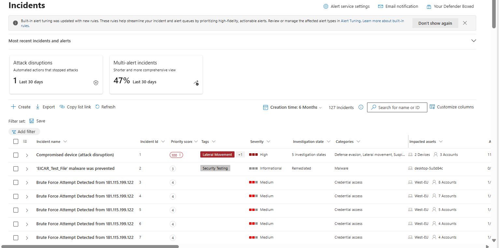


# 2. Incident Overview


Microsoft Defender XDR generated a High Severity incident:

**Incident Name:**

Compromised Device (Attack Disruption)


## Incident Classification

- Lateral Movement
- Attack Disruption
- Human-operated malicious activity


## Incident Timeline

| Attribute | Value |
|-|-|
| First Activity | July 1, 2026 21:02 |
| Last Activity | July 2, 2026 15:09 |
| Severity | High |
| Detection Source | Microsoft Defender XDR |
| Service Source | Microsoft Defender for Endpoint |
| Affected Devices | gmark-east1, west-eu-gmark |


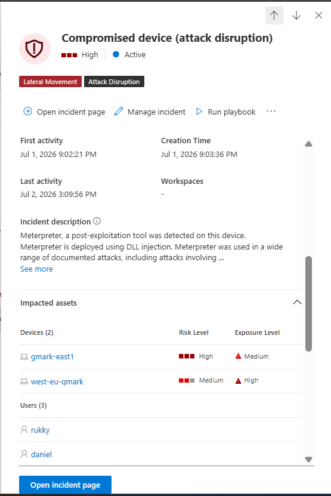


# 3. Incident Graph and Attack Correlation


Microsoft Defender XDR automatically correlated multiple alerts, devices, accounts, processes, and network indicators into a single security incident.

The incident graph demonstrated that the activity was not isolated to a single event. Multiple security signals were linked together, showing relationships between:

- Suspicious processes
- User accounts
- Endpoint activity
- Network communication
- Automated Defender response actions


## Key Relationships Identified


### Affected Devices

- gmark-east1

- west-eu-gmark


### User Accounts


- Admin

- rukky

- Daniel


### Suspicious Processes

- powershell.exe

- microsoft.exe

- microsoft (2).exe


### External Communication


drive.usercontent.google.com


### Defender Response Actions

- Device Isolation
- User Containment
- Attack Disruption
- Automated Investigation


The incident graph significantly reduced investigation time by automatically correlating telemetry from multiple Microsoft Defender data sources.


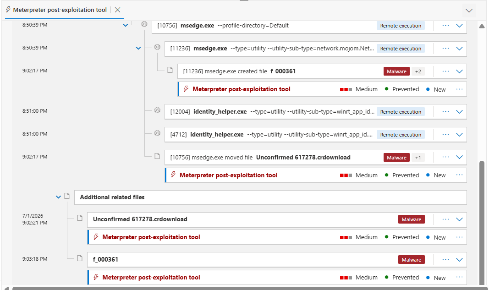


# 4. Investigation Methodology


The investigation followed a structured SOC incident response workflow:


## 4.1 Alert Validation

Reviewed Microsoft Defender XDR incident details, alert relationships, severity, and automated response actions.


## 4.2 Process Investigation

Analysed process execution chains using:

- DeviceProcessEvents
- Process tree analysis
- PowerShell command-line telemetry


## 4.3 Network Investigation

Reviewed endpoint communication using:

- DeviceNetworkEvents

Purpose:

- Identify suspicious outbound communication
- Validate possible malware delivery channels


## 4.4 Account and Lateral Movement Investigation

Analysed:

- DeviceLogonEvents
- RemoteInteractive logons
- Suspicious account behaviour


## 4.5 Evidence Collection

Collected:

- Malicious binaries
- Suspicious commands
- Account activity
- Registry modification attempts
- MITRE ATT&CK techniques


## 4.6 Containment Validation

Validated Microsoft Defender response actions:

- Device isolation
- User containment
- Automated investigation results


# 5. Microsoft Defender XDR Investigation Findings


# 5.1 Meterpreter Post-Exploitation Tool


## Investigation Summary

Microsoft Defender XDR detected Meterpreter activity, a post-exploitation framework commonly used by attackers for remote command execution, persistence, and lateral movement after initial access.


## Evidence

Device:
gmark-east1


Observed activity:

- Meterpreter post-exploitation tooling detected.
- Activity correlated with suspicious command execution.
- Additional alerts indicated lateral movement and hands-on-keyboard behaviour.


## MITRE ATT&CK Mapping

| Technique | ID |
|-|-|
| Command and Scripting Interpreter | T1059 |
| Remote Services | T1021 |


## Response

Microsoft Defender XDR initiated automated attack disruption and containment actions.


## Analyst Verdict

**High-confidence malicious post-exploitation activity.**

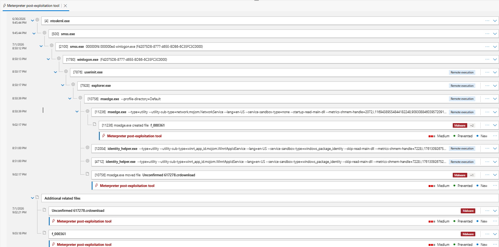

---


# 5.2 Compromised account conducting hands-on-keyboard attack

Observed activity:

- Privileged account activity
- Interactive command execution
- Remote access attempts


## MITRE ATT&CK Mapping

| Technique | ID |
|-|-|
| Valid Accounts | T1078 |
| Command and Scripting Interpreter | T1059 |


## Response

Microsoft Defender blocked suspicious remote activity and initiated containment.


## Analyst Verdict

**High-confidence suspicious account activity consistent with hands-on-keyboard behaviour.**

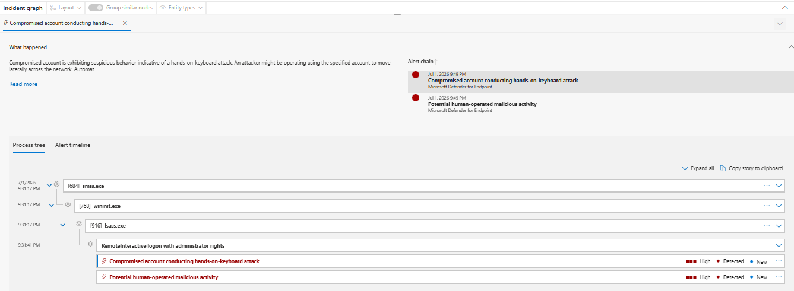

---


# 5.3 Potential Human-Operated Malicious Activity


## Investigation Summary

Microsoft Defender identified multiple coordinated behaviours associated with a potential human-operated attack.


## Evidence

Observed behaviours:

- Meterpreter execution
- PowerShell execution
- Credential misuse
- Defender protection modification attempts
- Lateral movement attempts


## MITRE ATT&CK Mapping

| Technique | ID |
|-|-|
| Impair Defenses | T1562.001 |
| Remote Services | T1021 |
| PowerShell | T1059.001 |


## Response

Microsoft Defender correlated multiple alerts and initiated automated attack disruption.


## Analyst Verdict

**High-confidence coordinated malicious activity.**

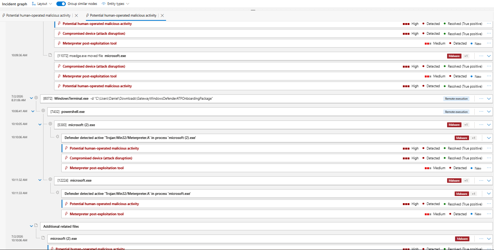

---


# 5.4 Attempt to Turn Off Microsoft Defender Antivirus Protection


## Investigation Summary

Microsoft Defender detected an attempt to weaken security controls by modifying Microsoft Defender Antivirus protection settings.


## Evidence

Device:
west-eu-gmark

powershell -ExecutionPolicy Unrestricted -File script3.ps1

PowerShell activity included:


- mkdir

- Set-Content

- Get-Location


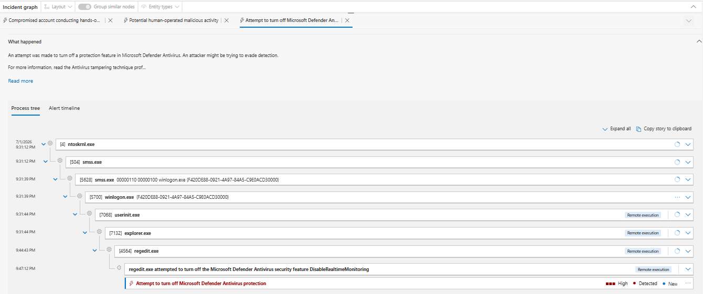


# 5.5 Azure RunScript used to deploy malicious code

### Investigation Summary
Microsoft Defender detected PowerShell scripts executed through Azure Run Command on an Azure VM.

### Evidence
- Device: `west-eu-gmark`
- Execution chain:

WindowsAzureGuestAgent.exe
→ RunCommandExtension.exe
→ cmd.exe
→ powershell.exe


Scripts executed:

- script3.ps1
- script7.ps1
- script8.ps1
- script10.ps1


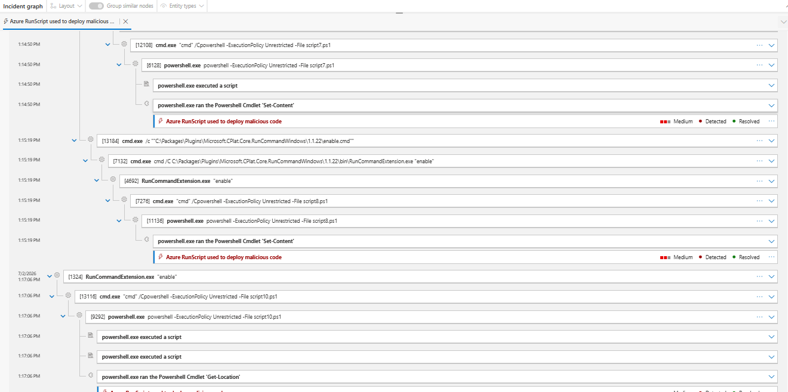


# 6. Scope and Impact Assessment


## Affected Devices


| Device | Status |
|-|-|
| `gmark-east1` | Isolated by Microsoft Defender XDR |
| `west-eu-gmark` | Isolated by Microsoft Defender XDR |


## Accounts Observed


| Account | Observed Activity |
|-|-|
| `Admin` | Attempted Microsoft Defender protection modification |
| `rukky` | Associated with blocked RDP lateral movement |
| `Daniel` | Observed during suspicious account activity |
| `system` | Azure RunScript execution context |


## Impact Assessment


Based on available Defender XDR telemetry:

- Multiple endpoints exhibited suspicious attacker behaviour.
- Malicious tooling and script execution were detected.
- Attempts to evade security controls were identified.
- Lateral movement activity was detected and disrupted.
- No evidence of successful data exfiltration was identified.

Microsoft Defender XDR successfully limited further attacker activity through automated containment actions.


# 7. Attack Chain Reconstruction


The investigation reconstructed the following attack lifecycle:

Initial Malware Execution
    |
Meterpreter Post-Exploitation Activity
    |
Malicious Executable Execution
(microsoft.exe / microsoft (2).exe)
    |
PowerShell-Based Script Execution
    |
Defense Evasion Attempt
(DisableRealtimeMonitoring)
    |
Credential Abuse / Hands-on-Keyboard Activity
    |
Lateral Movement Attempt
(RDP RemoteInteractive Logon)
    |
Remote Command Execution
(Azure RunScript)
    |
Microsoft Defender Attack Disruption
(Device Isolation + User Containment)


The observed behaviour aligns with a multi-stage attack involving execution, defense evasion, credential misuse, and lateral movement techniques.


# 8. Advanced Hunting Investigation

# 8.1 PowerShell Execution Investigation

## Objective

Determine how PowerShell was executed and identify evidence of suspicious script execution.

## KQL Query


```
union
(
    DeviceProcessEvents
    | where DeviceName contains "gmark"
    | where FileName =~ "powershell.exe"
    | project
        Timestamp,
        AccountName,
        ProcessCommandLine,
        InitiatingProcessFileName,
        InitiatingProcessCommandLine
    | order by Timestamp asc
    | take 5
),
(
    DeviceProcessEvents
    | where DeviceName contains "gmark"
    | where FileName =~ "powershell.exe"
    | project
        Timestamp,
        AccountName,
        ProcessCommandLine,
        InitiatingProcessFileName,
        InitiatingProcessCommandLine
    | order by Timestamp desc
    | take 15
)
| order by Timestamp asc

```

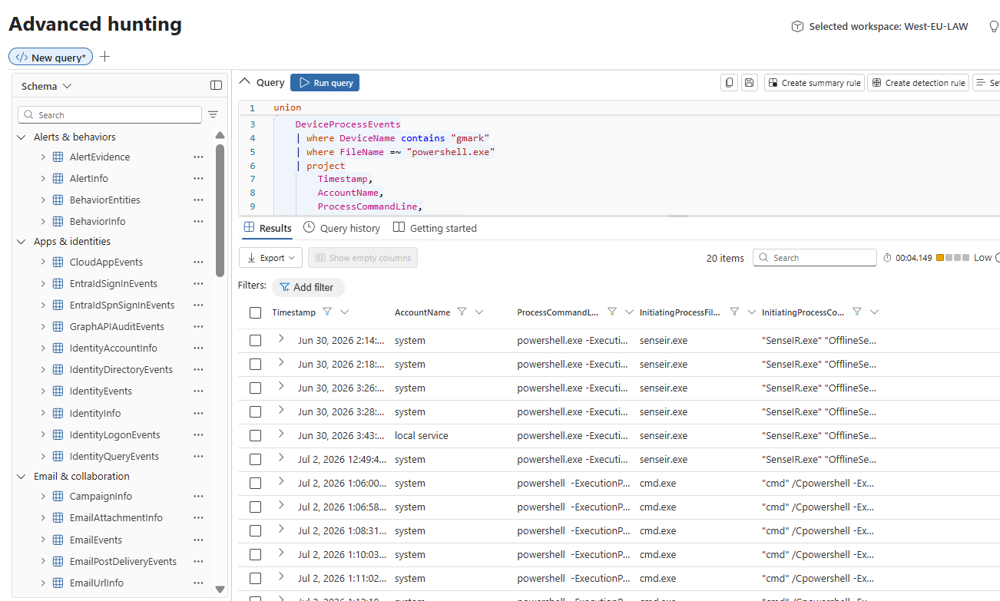

# Findings

Multiple PowerShell executions were observed.

Example command:

powershell -ExecutionPolicy Unrestricted -File script3.ps1

Observed script execution:

```
script0.ps1
script1.ps1
script3.ps1
script7.ps1
script8.ps1
script10.ps1
script11.ps1
```

Parent process:

```
cmd.exe

Parent command:

cmd /C powershell -ExecutionPolicy Unrestricted -File scriptX.ps1
```

# Assessment

The PowerShell activity was considered suspicious due to:

Execution policy bypass
Remote execution context
Multiple script executions
Correlation with other malicious alerts

# 8.2 External Network Communication Review
Objective

Identify external communication associated with suspicious execution activity.

```
DeviceNetworkEvents
| where DeviceName contains "gmark"
| where RemoteUrl contains "usercontent"
   or RemoteUrl contains "google"
| project
    Timestamp,
    DeviceName,
    InitiatingProcessFileName,
    InitiatingProcessCommandLine,
    RemoteUrl,
    RemoteIP,
    RemotePort
| order by Timestamp asc
```

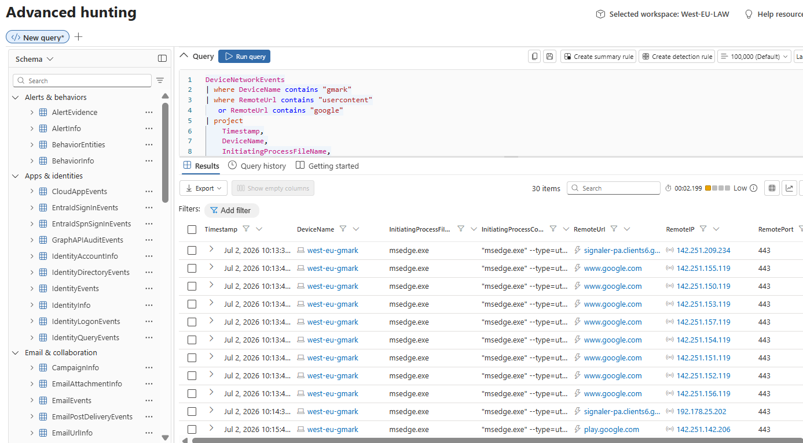

# Findings

Outbound HTTPS communication was observed to:

```
drive.usercontent.google.com

drive.google.com

www.google.com

play.google.com

accounts.google.com
```

# Protocol:

HTTPS TCP/443

Observed initiating process:

```
msedge.exe
```

No evidence was identified showing:

```
powershell.exe

certutil.exe

curl.exe

bitsadmin.exe
```

performing the download operation.

### Assessment

The observed Google-related communication was reviewed as part of malware investigation. Based on available telemetry, no confirmed malicious download activity was attributed to these connections.

# 8.3 Lateral Movement Investigation
Objective

Determine whether suspicious accounts attempted remote access between systems.

```
DeviceLogonEvents
| where DeviceName contains "gmark"
| where LogonType contains "RemoteInteractive"
| project
    Timestamp,
    DeviceName,
    AccountName,
    RemoteDeviceName,
    RemoteIP,
    LogonType,
    ActionType
| order by Timestamp asc
```

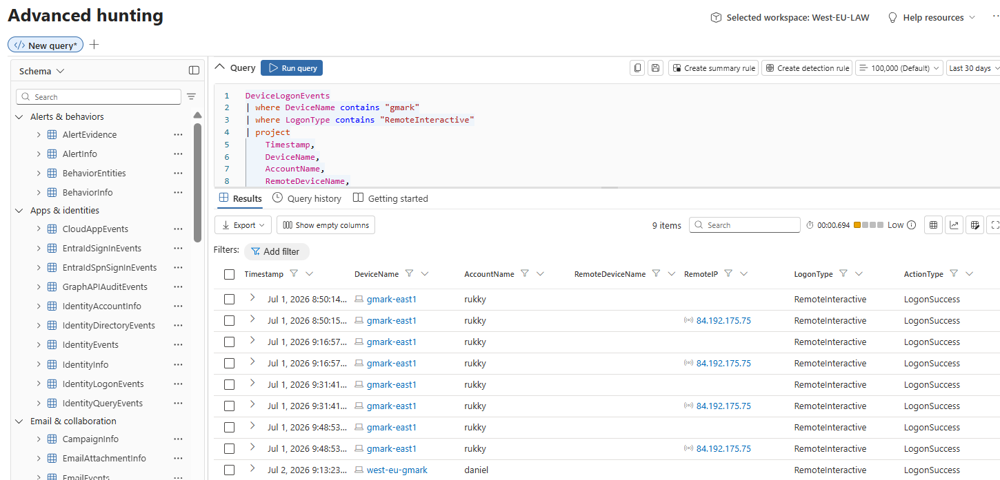

# findings

| Evidence    | Value             |
| ----------- | ----------------- |
| Logon Type  | RemoteInteractive |
| Action      | LogonSuccess      |
| Account     | rukky             |
| Source IP   | 84.192.175.75     |
| Destination | gmark-east1       |


Assessment

The activity is consistent with an attempted RDP-based lateral movement event.

```
DeviceLogonEvents
| where AccountName in ("rukky","daniel","Admin")
| summarize
    Devices=dcount(DeviceName),
    DeviceList=make_set(DeviceName)
    by AccountName
```

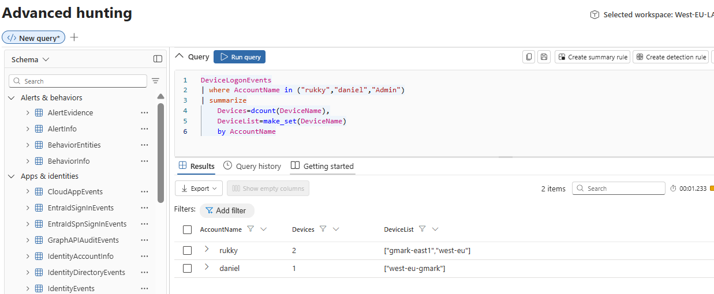


# findings

| Account | Devices Accessed |
| ------- | ---------------- |
| rukky   | 2                |
| daniel  | 1                |

Assessment

The investigation confirmed suspicious account activity across multiple endpoints.

# 9. Evidence Collection
Indicators and Evidence Collected

| Evidence Type | Indicator                      | Classification             | Context                         |
| ------------- | ------------------------------ | -------------------------- | ------------------------------- |
| File          | `microsoft.exe`                | Malicious artifact         | Suspicious executable detected  |
| File          | `microsoft (2).exe`            | Malicious artifact         | Executable variant              |
| File          | `f_000360`                     | Suspicious artifact        | Defender evidence file          |
| File          | `f_000361`                     | Suspicious artifact        | Defender evidence file          |
| File          | `f_000373`                     | Suspicious artifact        | Defender evidence file          |
| File          | `f_000376`                     | Suspicious artifact        | Defender evidence file          |
| Process       | `powershell.exe`               | Suspicious execution       | Script execution                |
| Process       | `regedit.exe`                  | Suspicious activity        | Registry modification context   |
| Process       | `lsass.exe`                    | Sensitive process observed | Windows security process        |
| Registry      | `DisableRealtimeMonitoring`    | Defense evasion indicator  | Defender modification attempt   |
| Domain        | `drive.usercontent.google.com` | Network indicator          | External communication observed |
| IP Address    | `84.192.175.75`                | Suspicious source          | RDP activity source             |


# 10. Investigation Verdict

**Verdict: Confirmed Malicious Activity**

Microsoft Defender XDR identified and disrupted a multi-stage attack involving post-exploitation tooling, PowerShell execution, defense evasion attempts, suspicious account activity, and lateral movement behaviour.

Containment actions were successfully executed, and no evidence of further compromise or data exfiltration was identified during the investigation.