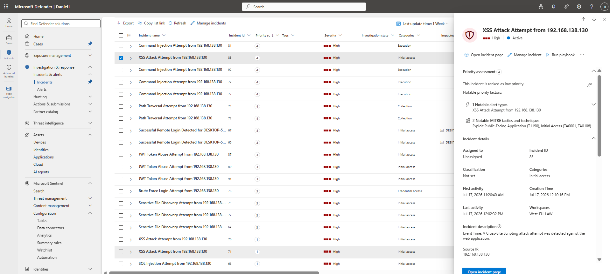
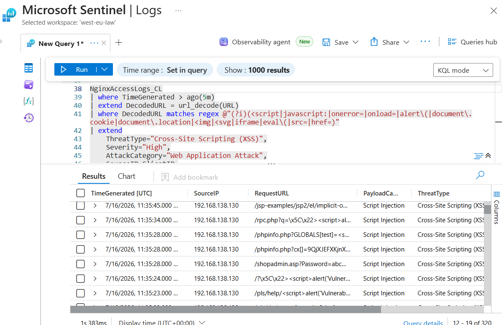
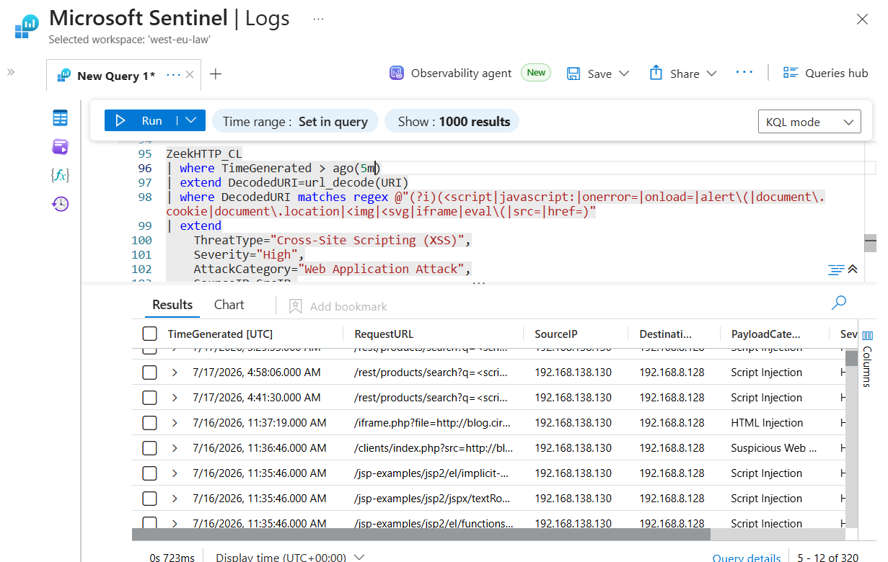
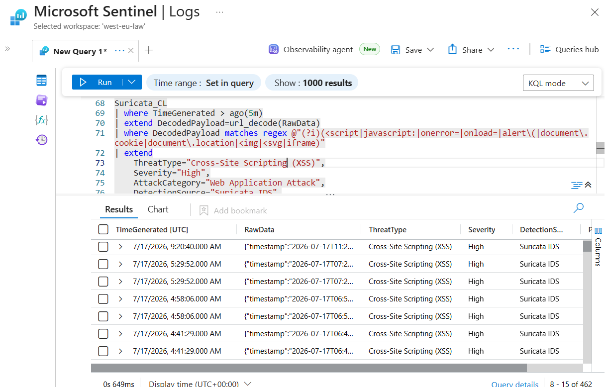
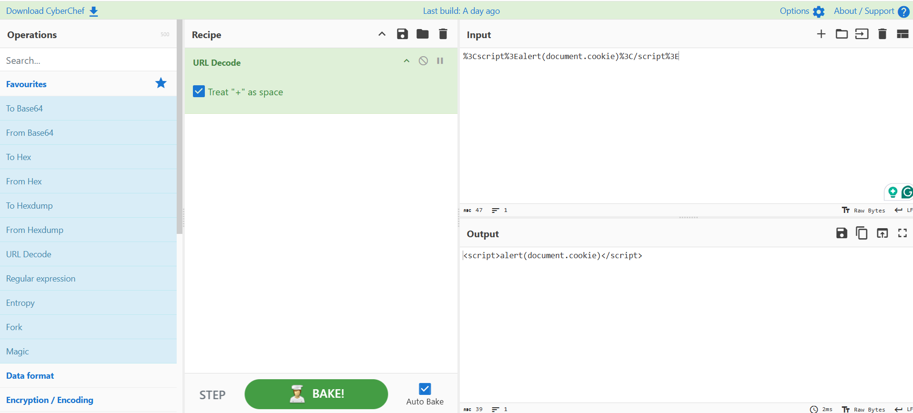

# Cross-Site Scripting (XSS) Investigation Report

**Author:** Ovuowo Rukevwe  
**Role:** SOC Analyst (Portfolio Project)  
**Platform:** Microsoft Sentinel  
**Date of Investigation:** 17 July 2026  
**Incident Severity:** High  
**Incident Status:** Closed – Attempt Detected, No Confirmed Compromise

---

# Executive Summary

On **17 July 2026**, Microsoft Sentinel generated a **High Severity** alert indicating a possible **Cross-Site Scripting (XSS)** attack targeting the **OWASP Juice Shop** web application.

The investigation identified multiple HTTP requests originating from **192.168.138.130** containing JavaScript payloads commonly associated with XSS attacks. Analysis was performed using **Nginx Access Logs**, **Zeek HTTP Logs**, and **Suricata IDS** to validate the alert, identify the malicious payloads, and determine whether the attack was successful.

The investigation confirmed that malicious requests reached the web application; however, no evidence was found to indicate successful JavaScript execution, session cookie theft, or data exfiltration.

The incident was therefore classified as an **Attempted Cross-Site Scripting (XSS) Attack** with **no confirmed compromise**.

---

# Incident Overview

| Field | Value |
|--------|-------|
| Incident Name | Possible Cross-Site Scripting Attack |
| Severity | High |
| Category | Web Application Attack |
| Detection Platform | Microsoft Sentinel |
| Target Application | OWASP Juice Shop |
| Source IP | 192.168.138.130 |
| Destination IP | 192.168.8.128 |
| Attack Type | Cross-Site Scripting (XSS) |
| Primary Detection Time | 17 July 2026 - 05:29:52 UTC |
| Investigation Status | Closed |

---

# Investigation Methodology

The investigation followed the workflow below:

1. Validate the Sentinel alert.
2. Identify the malicious payload.
3. Correlate evidence across Nginx, Zeek, and Suricata logs.
4. Decode and analyze the payload.
5. Assess whether the payload executed successfully.
6. Determine the overall impact.
7. Document findings and recommendations.

---

# Evidence Collection and Analysis



### Findings

Microsoft Sentinel generated a **High Severity** alert for suspicious HTTP requests containing XSS indicators.

The alert identified:

- Source IP: **192.168.138.130**
- Target: **OWASP Juice Shop**
- Attack Category: **Web Application Attack**


The alert warranted further investigation to determine whether the detected activity represented an actual attack or a false positive.

---

# 2. Nginx Access Log Analysis

### Objective

Identify whether the malicious request reached the web server.

### KQL Query

```kql
NginxAccessLogs_CL
| where TimeGenerated > ago(7d)
| extend DecodedURL = url_decode(URL)
| where DecodedURL matches regex @"(?i)(<script|javascript:|document\.cookie|onerror=|onload=|alert\()"
| project TimeGenerated, ClientIP, DecodedURL
| order by TimeGenerated desc
```



### Findings

The web server received multiple HTTP requests containing encoded JavaScript payloads.

Example:

```
/rest/products/search?q=%3Cscript%3Ealert(1)%3C/script%3E
```

Decoded payload:

```html
<script>alert(1)</script>
```

The requests originated from:

**192.168.138.130**

The malicious payload successfully reached the web application.

---

# 3. Zeek HTTP Analysis

### Objective

Validate the attack using independent HTTP telemetry.

### KQL Query

```kql
ZeekHTTP_CL
| where TimeGenerated > ago(7d)
| extend DecodedURI=url_decode(URI)
| where DecodedURI matches regex @"(?i)(<script|javascript:|document\.cookie|alert\()"
| project TimeGenerated, SrcIP, DestIP, DecodedURI
| order by TimeGenerated desc
```



### Findings

Zeek confirmed multiple HTTP requests containing JavaScript payloads.

Observed payload:

```html
<script>alert(document.cookie)</script>
```

The payload attempted to access the browser's session cookies, which is a common objective during XSS attacks.

Zeek independently confirmed the malicious HTTP requests observed in the Nginx logs.

---

# 4. Suricata IDS Analysis

### Objective

Determine whether the network IDS detected the attack.

### KQL Query

```kql
Suricata_CL
| where TimeGenerated > ago(7d)
| where RawData contains "document.cookie"
    or RawData contains "<script>"
| project TimeGenerated, SrcIP, DestIP, RawData
```



### Findings

Suricata detected suspicious HTTP traffic associated with script injection attempts.

The IDS confirmed communication between:

- Source: **192.168.138.130**
- Destination: **192.168.8.128**


Network telemetry corroborated the activity identified by Sentinel, Nginx, and Zeek.

---

# 5. Payload Analysis

### Encoded Payload

```text
%3Cscript%3Ealert(document.cookie)%3C/script%3E
```

### Decoded Payload

```html
<script>alert(document.cookie)</script>
```




### Findings

The payload attempts to execute JavaScript that accesses the browser's session cookies.

While the payload demonstrates malicious intent, no evidence was found that the script executed successfully.

**Conclusion**

The payload represents a classic reflected XSS attempt targeting session cookies.

---

# Timeline of Events

| Time (UTC) | Activity |
|------------|----------|
| 16 Jul 2026 | Initial XSS payloads observed |
| 17 Jul 2026 | Encoded JavaScript payload submitted |
| 17 Jul 2026 | Zeek confirmed malicious HTTP requests |
| 17 Jul 2026 | Suricata detected associated network traffic |
| 17 Jul 2026 | Investigation completed |

---


# Indicators of Compromise (IOC)

The following indicators were identified during the investigation of the Cross-Site Scripting (XSS) attack attempt.

| IOC Type | Indicator | Description | Source |
|----------|-----------|-------------|--------|
| Source IP Address | 192.168.138.130 | Host responsible for generating malicious XSS requests | Nginx Logs, Zeek HTTP, Suricata |
| Destination IP Address | 192.168.8.128 | Target web application server (OWASP Juice Shop) | Zeek HTTP, Suricata |
| Attack Type | Cross-Site Scripting (XSS) | Web application attack involving JavaScript injection | Sentinel Detection |
| Malicious Payload | `<script>alert(1)</script>` | Script injection payload used to test JavaScript execution | Nginx Logs |
| Malicious Payload | `<script>alert(document.cookie)</script>` | XSS payload attempting to access browser cookies | Zeek HTTP Logs |
| Encoded Payload | `%3Cscript%3Ealert(1)%3C/script%3E` | URL encoded version of JavaScript injection payload | Nginx Logs |
| Encoded Payload | `%3Cscript%3Ealert(document.cookie)%3C/script%3E` | URL encoded cookie theft attempt | Web Logs |
| Malicious URI | `/rest/products/search?q=<script>alert(1)</script>` | Search parameter abused for XSS injection | Nginx Logs |
| Malicious URI | `/sysuser/docmgr/edit.stm?path=<script>alert(document.cookie)</script>` | Parameter injection attempt | Zeek HTTP Logs |
| Malicious URI | `/sysuser/docmgr/create.stm?path=<script>alert(document.cookie)</script>` | Parameter injection attempt | Zeek HTTP Logs |
| Malicious URI | `/wwwping/index.stm?wwwsite=<script>alert(document.cookie)</script>` | Parameter injection attempt | Zeek HTTP Logs |
| User-Agent | gobuster/3.6 | Tool used during web content discovery and enumeration | Zeek HTTP Logs |
| Protocol | HTTP | Attack conducted through unencrypted web traffic | Zeek HTTP, Suricata |
| Port | TCP/80 | Target web service receiving malicious requests | Suricata |


---

# Impact Assessment

## Confirmed

- Malicious HTTP requests reached the web application.
- Multiple JavaScript payloads were submitted.
- Sentinel, Nginx, Zeek, and Suricata all observed the attack.

## Not Confirmed

- JavaScript execution.
- Session cookie theft.
- Account compromise.
- Data exfiltration.
- Persistent access.


---

# Final Assessment

The investigation confirmed multiple Cross-Site Scripting (XSS) attempts targeting the OWASP Juice Shop web application. Evidence collected from Microsoft Sentinel, Nginx Access Logs, Zeek HTTP Logs, and Suricata IDS consistently identified malicious JavaScript payloads submitted by the source host **192.168.138.130**.

Although the payloads successfully reached the application, there was no evidence to indicate successful script execution, session hijacking, or data exfiltration.

**Final Classification:** **Attempted Cross-Site Scripting (XSS) Attack – No Confirmed Compromise**