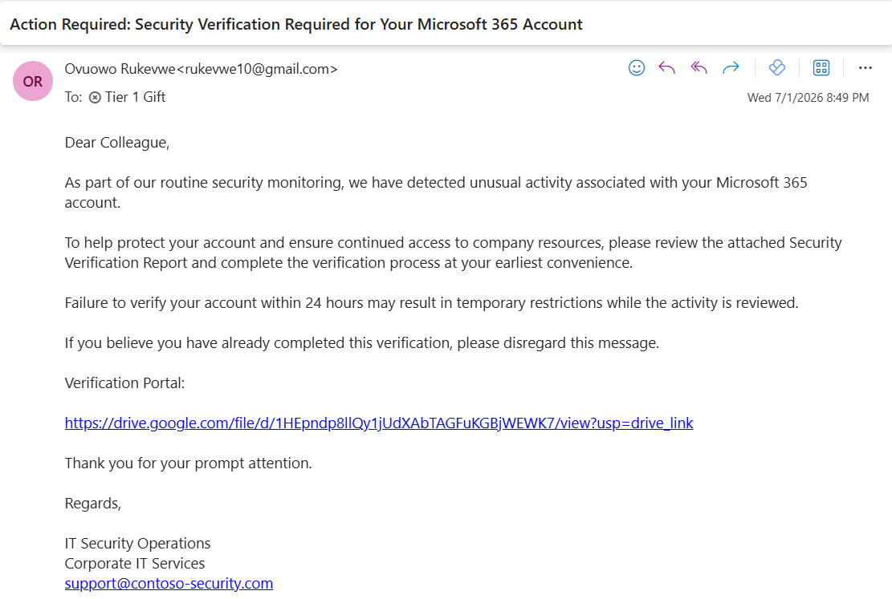
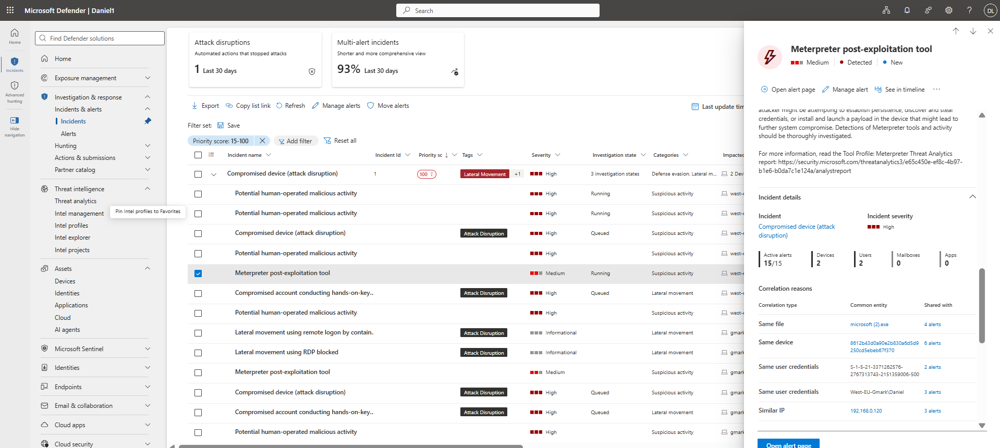
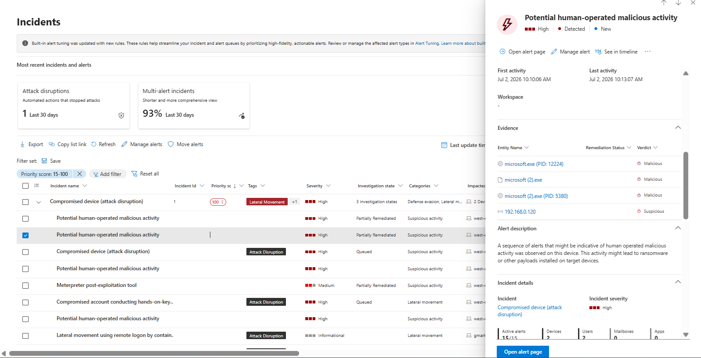
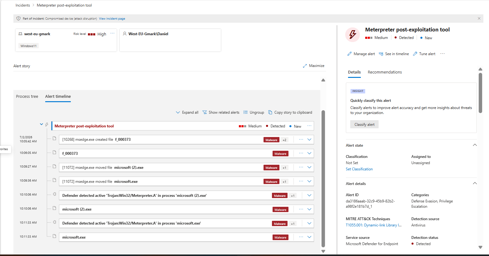
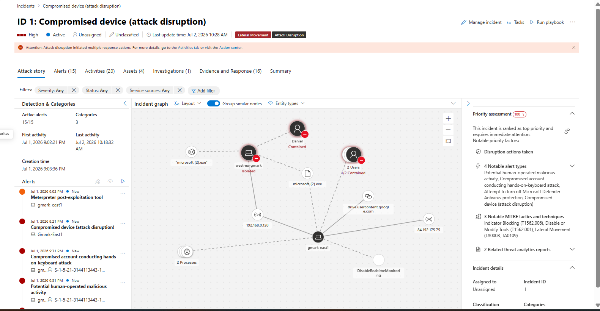
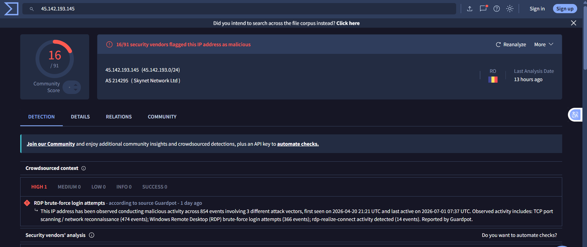
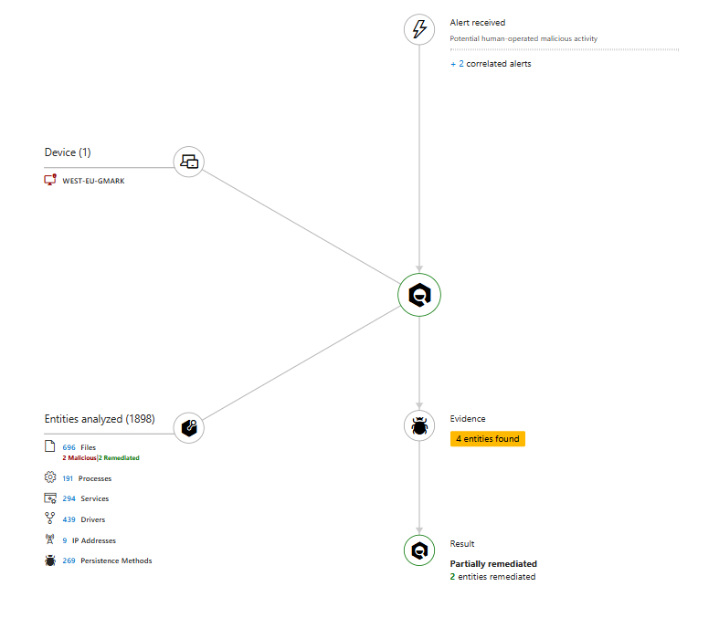

# 01 – Phishing Email Investigation

## Scenario

An employee reported a suspicious email containing a Google Drive link. The email was analyzed to determine its legitimacy and to investigate whether the downloaded content resulted in endpoint compromise. Microsoft Defender XDR, Defender for Endpoint, and the Azure portal were used throughout the investigation to validate the email, reconstruct the attack timeline, identify indicators of compromise (IOCs), and assess the overall impact.

This screenshot shows the phishing email received by the employee.



The email was exported as an **.eml** file and examined in Visual Studio Code to review the message headers and authentication results.

## Header Analysis

**Authentication Results**

- SPF: Pass
- DKIM: Pass
- DMARC: Pass

Although the email successfully passed SPF, DKIM, and DMARC validation, further investigation showed that it contained a Google Drive link hosting a malicious payload. The authenticated headers confirmed that the email originated from Google's mail infrastructure and that no evidence of email spoofing was present. This demonstrates that authenticated emails can still be used to distribute malicious content when legitimate cloud services are abused.
---

## URL Analysis

The email contained the following Google Drive URL:

```
https://drive.google.com/file/...
```

After the link was opened, Microsoft Defender observed the payload being downloaded from:

```
https://drive.usercontent.google.com/download?id=...
```

This confirmed that the phishing email was being used to deliver malware through Google Drive rather than a malicious domain.



---

## Detection in Microsoft defender portal

Endpoint detected the malware and an alert was triggered, resulting to an incident been created.



---

## Attack Story

After the phishing email was clicked, Microsoft Edge initiated the download process and stored the payload in the browser cache.

```
msedge.exe
    ↓
download initiated from Google Drive
    ↓
created file: f_000373 (browser cache)
    ↓
payload identified as: Trojan:Win32/Meterpreter.A
    ↓
file staged as:
    microsoft.exe
    microsoft (2).exe
    (C:\Lab tools\)
    ↓
PowerShell execution observed
    ↓
Meterpreter post-exploitation behavior detected
```

This confirms that the initial payload was staged through Microsoft Edge before being executed from a local directory.

---

## File and Process Analysis

### Downloaded Payload

Microsoft Edge created a cached file during the download process:

```
f_000373
Location:
C:\Users\Daniel\AppData\Local\Microsoft\Edge\User Data\Default\Cache\Cache_Data\f_000373
```

This file was later identified by Defender as:

```
Trojan:Win32/Meterpreter.A
SHA1: 8d8c4b86bb18481430949bf9cd58a6d5929d02aa
```

**Location**

```
C:\Lab tools\
```

This behavior matched **MITRE ATT&CK T1036.005 – Masquerading**, where malware attempts to appear as trusted software to reduce suspicion.



The incident graph correlated the phishing email, the affected user, the compromised device, the downloaded payload, and the resulting Defender alerts into a single investigation. This provided a clear view of the attack progression from initial access through execution and post-compromise activity.



The process tree confirmed execution of the downloaded payload and subsequent malicious behavior detection by Microsoft Defender. Additional telemetry showed outbound communication attempts consistent with Meterpreter activity over TCP port **444**.

## Network Activity

Further investigation identified another external IP address **45.142.193.145** during the attack timeline. Threat intelligence enrichment using VirusTotal showed that the address had previously been reported for malicious activity, including brute-force attempts and reconnaissance behavior.

This increased confidence that the observed communication was associated with external attacker infrastructure rather than legitimate traffic.


---

## Process Tree Observations

The process tree confirmed the following sequence:

```
msedge.exe
    ↓
f_000373 created (downloaded payload)
    ↓
Meterpreter detection triggered
```


### Key Observation

- Googledrive used as the initial delivery vector
- The malicious file was written to browser cache before being staged locally
- Execution was blocked/detected by Microsoft Defender


---

## Incident Correlation (Graph View)

The incident graph correlated:

- Email delivery
- User interaction
- File download
- Endpoint execution
- Defender detection events

This provided a unified timeline of the attack lifecycle from initial access to detection.


---

## Network and C2 Activity

Following execution, telemetry indicated attempted outbound communication consistent with Meterpreter behavior. The process attempted communication over non-standard port activity associated with command-and-control behavior.


---

## Affected Entities

The affected entities view provided correlation between:

- User account
- Endpoint
- Malicious process execution
- Defender detection alerts

This helped confirm that activity was contained to a single endpoint during the investigation.



---

## Indicators of Compromise (IOCs)

| Indicator | Value |
|----------|------|
| Malware | Trojan:Win32/Meterpreter.A |
| SHA1 | 8d8c4b86bb18481430949bf9cd58a6d5929d02aa |
| Download Artifact | f_000373 |
| Staged Files | microsoft.exe, microsoft (2).exe |
| Delivery Method | Google Drive |
| External IP | 45.142.193.145 |
| MITRE Technique | T1036.005 – Masquerading |

---

## Attack Timeline
The screeshot as seen below is teh attack timeline.


---


## Attack Chain

Phishing Email
        │
        ▼
Google Drive link opened
        │
        ▼
Payload downloaded from Google Drive
        │
        ▼
microsoft.exe / microsoft (2).exe staged
        │
        ▼
Execution of downloaded payload
        │
        ▼
Meterpreter activity detected
        │
        ▼
Communication with external IP 45.142.193.145
        │
        ▼
Post-compromise activity observed
        ├── Outbound communication attempts (TCP 444)
        └── Defender behavioral detections triggered
                │
                ▼
Microsoft Defender detects Trojan:Win32/Meterpreter.A
                │
                ▼
Endpoint automatically isolated

---

## Findings

- The phishing email used Google Drive as a delivery mechanism for malware.
- Microsoft Edge downloaded the payload and stored it in browser cache before staging it locally.
- The payload was identified as **Trojan:Win32/Meterpreter.A**.
- The malware was renamed into masqueraded executables (`microsoft.exe`, `microsoft (2).exe`) to evade detection.
- Execution triggered Meterpreter behavior, including post-exploitation indicators and attempted command-and-control communication.
- Microsoft Defender successfully detected and blocked the malicious payload.
- Threat intelligence confirmed the external IP involved had prior malicious activity.
- No evidence of successful persistence or lateral movement was observed in this investigation.

---

## Conclusion

The investigation confirmed a phishing-based malware delivery attempt using Google Drive as the initial payload hosting mechanism. Microsoft Edge downloaded the malicious file, which was staged locally and executed as a Meterpreter payload. The execution attempted post-exploitation behavior, including command-and-control communication and system interaction patterns consistent with Meterpreter activity.

Microsoft Defender for Endpoint successfully detected the malicious activity and blocked execution, preventing further compromise. Correlation across Defender XDR telemetry confirmed the attack chain remained contained to the initial endpoint, with no evidence of lateral movement or persistence established.