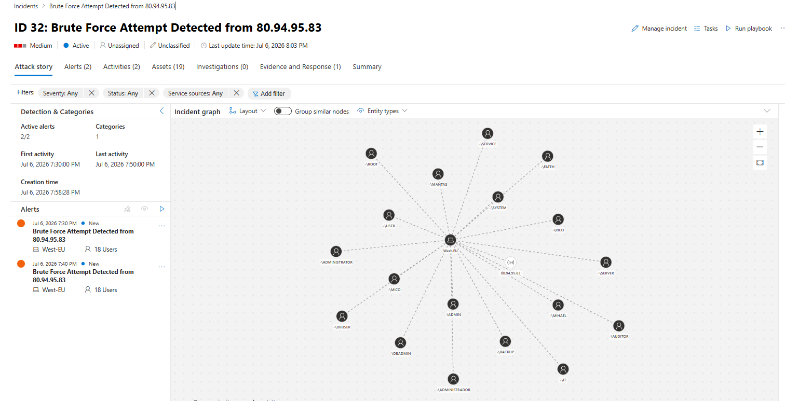
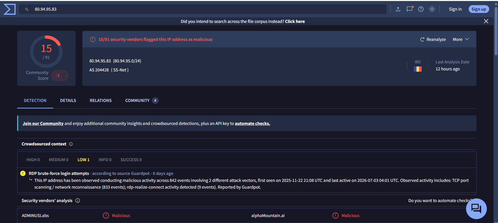
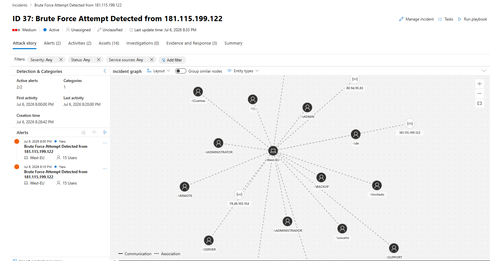
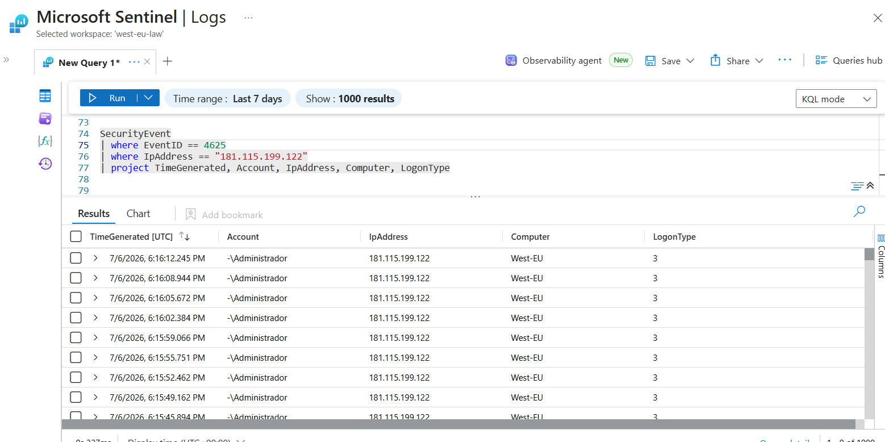
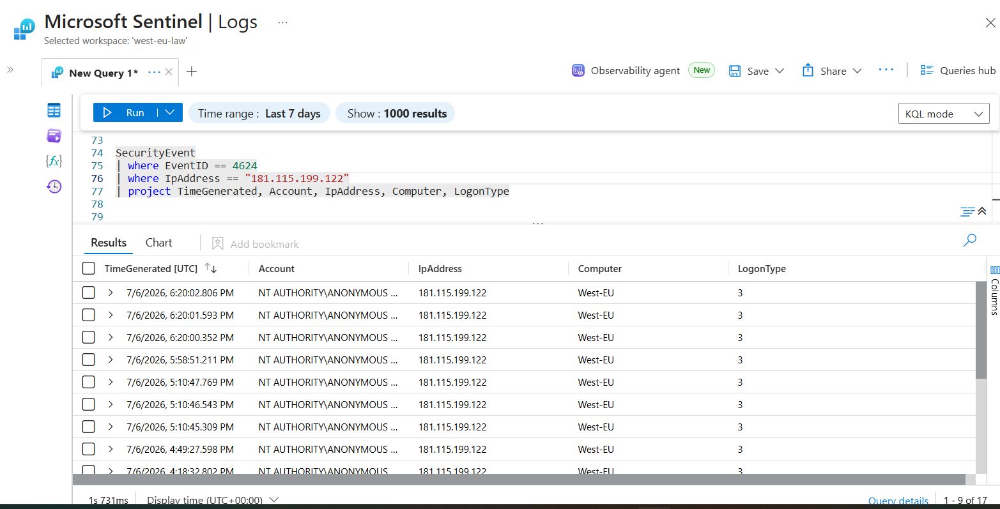
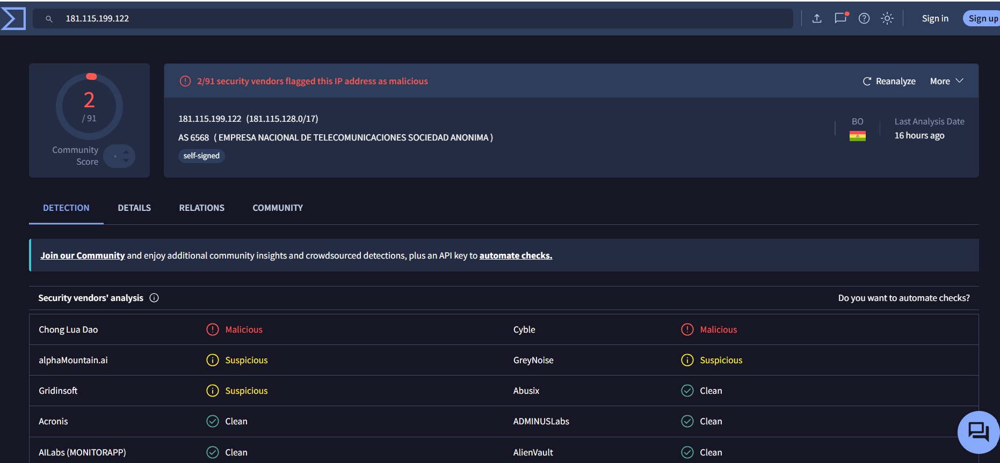

# Brute Force Attack Investigations

## Overview

This document summarizes two brute-force investigations detected by Microsoft Defender XDR and Microsoft Sentinel.

Cases investigated:

1. **Case 1: Failed Brute Force Attempt (False Positive)**
2. **Case 2: Brute Force Attack Resulting in Successful Authentication (True Positive)**

---

# Case 1: Failed Brute Force Attempt (False Positive)

## Incident Summary

Microsoft Defender XDR detected multiple failed authentication attempts from an external IP address targeting the **West-EU** host.


| Attribute   | Details           |
| ----------- | ----------------- |
| Incident ID | 30                |
| Source IP   | 80.94.95.83       |
| Severity    | Medium            |
| Category    | Credential Access |



Threat intelligence identified the IP as suspicious:

* Network: SS-Net
* ASN: 204428
* Location: United Kingdom
* 15/91 security vendors flagged the IP as malicious



---

## Investigation Findings

Security logs were reviewed to determine whether the attack resulted in unauthorized access.

Findings:

* Multiple failed authentication attempts detected.

* Windows Event ID **4625** confirmed multiple failed logons from this external IP address.


* No successful authentication events were identified.


* No evidence of account compromise or post-authentication activity was found.
---

## Impact Assessment

| Finding               | Status         |
| --------------------- | -------------- |
| Brute-force attempt   | Confirmed      |
| Failed authentication | Confirmed      |
| Successful login      | Not detected   |
| Credential compromise | Not identified |
| System impact         | None observed  |

---

## Verdict

**Classification: False Positive – Failed Brute Force Attempt**

The attacker failed to obtain valid credentials. No unauthorized access or compromise was identified.

**Closure Status:** Closed – False Positive

---

# Case 2: Brute Force Attack Resulting in Successful Authentication (True Positive)

## Incident Summary

Microsoft Defender XDR and Microsoft Sentinel detected brute-force authentication attempts targeting the **West-EU** server.



| Attribute    | Details             |
| ------------ | ------------------- |
| Incident ID  | 37                  |
| Severity     | Medium              |
| Category     | Credential Access   |
| MITRE ATT&CK | T1110 – Brute Force |

Investigation confirmed multiple failed attempts followed by successful authentication from external IP addresses.

---

# Source Investigation

- **78.46.102.154** – Multiple failed authentication attempts were observed.

- **80.94.95.83** – Multiple failed authentication attempts were observed.

- **181.115.199.122** – Multiple failed authentication attempts followed by a successful login were observed, as shown below.

![Multiple failed authentication attempts from 181.115.199.122]

The successful logon event is shown below.

![Successful logon event]

- **84.192.175.75** – Multiple failed authentication attempts followed by a successful login were observed.

- **34.77.166.77** – Multiple failed authentication attempts followed by a successful login were observed.

---

# Threat Intelligence Findings

## 181.115.199.122



* Registered to Empresa Nacional de Telecomunicaciones Sociedad Anonima (ENTEL).
* Located in Bolivia.
* Historical threat intelligence observations identified.
* Successful remote authentication detected.

## 34.77.166.77

* Associated with Google Cloud infrastructure.
* Historical exposure of remote access services identified.
* Services observed included SSH, RDP, and web services.
* Successful authentication detected.

## 84.192.175.75

* Multiple failed authentication attempts followed by successful authentication.

---

# Investigation Findings

Authentication logs and endpoint telemetry were reviewed.

Confirmed:

* Multiple external IPs performed brute-force attempts.
* Multiple accounts were targeted.
* Successful authentication occurred from:

```
181.115.199.122
84.192.175.75
34.77.166.77
```

The successful logons indicate that valid credentials were accepted.

---

# Post-Authentication Investigation

Defender Timeline, Sentinel logs, and security events were reviewed.

No evidence was found of:

* Privilege escalation
* Malware execution
* PowerShell abuse
* Credential dumping
* Persistence creation
* Lateral movement
* Data exfiltration

The activity appears limited to unauthorized authentication.

---

# Impact Assessment

| Finding                   | Status       |
| ------------------------- | ------------ |
| Brute-force activity      | Confirmed    |
| Failed authentication     | Confirmed    |
| Successful authentication | Confirmed    |
| Credential compromise     | Confirmed    |
| Post-exploitation         | Not observed |
| Malware execution         | Not observed |
| Data exfiltration         | Not observed |

---

# Verdict

**Classification: True Positive – Successful Unauthorized Authentication**

The incident was confirmed as a brute-force attack that resulted in successful authentication from three external IP addresses.

Although valid credentials were used, no evidence of further attacker activity was identified.

**Confirmed impact: Unauthorized account access only.**

---

# Recommended Actions

1. Reset affected account credentials.
2. Enable MFA for remote access.
3. Review account permissions.
4. Monitor affected accounts for suspicious activity.
5. Block or monitor identified IP addresses.
6. Review RDP/SMB exposure.
7. Check for persistence mechanisms after successful logons.

---

# Closure Status

## Case 1

**Closed – False Positive**

Failed brute-force attempt with no successful authentication.

## Case 2

**Closed – True Positive**

Successful brute-force authentication confirmed. No post-exploitation activity identified.

Previous: [01 - Phishing Email Investigation](Investigations/01-Phishing-Email-Investigation.md)